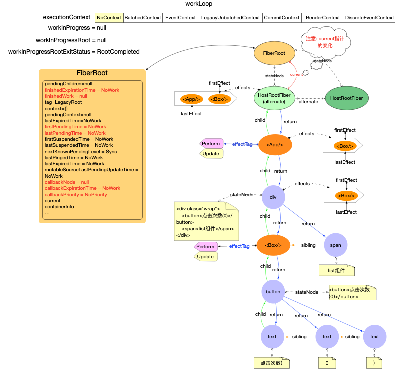

# react更新机制

由于`lagacyMode`和`blockingMode`的更新机制不同.
1. `lagacyMode`下更新是同步的, 不会被打断
2. `blockingMode`下的更新有可能会被打断, 导致`render`阶段之前的生命周期函数多次执行.

这里先讨论`lagacyMode`下的更新, 对于其他模式下的更新, 在react任务分片中展开介绍

正常react应用有3种主动更新方式:

1. `Class`组件中主动调用`setState`.
2. `Function`组件中使用`hook`对象的`dispatchAction`.
3. 改变`context`

## setState

继续使用[首次render](./02-render-process.md)中的例子.

定义`<App/>`组件的结构如下:

```js

class App extends React.Component{
  componentDidMount(){
    console.log('App componentDidMount')
  }
  render(){
    return (
      <div class="wrap">
        <Box/>
        <span>list组件</span>
    </div>
    );
  }
}
class Box extends React.Component{
  state = {
    count: 0
  }
  handleClick = ()=>{
    this.setState(state=>{
      return {
        count: ++state.count
      }
    })
  }
  componentDidMount(){
    console.log('Box componentDidMount')
  }
  render(){
    return <button onClick={this.handleClick}>点击次数({this.state.count})</button>
  }
}

```

在初次`render`结束后, 工作空间的主要变量的状态如下:



`<Box/>`组件中, `button`上绑定一个`onClick`事件, 点击按钮之后执行`handleClick`函数, 并且调用`setState`触发更新.

### 环境准备

从[合成事件](./03-syntheticEvent.md#事件触发)中, 对事件触发的分析得知, `onClick`事件对应的`listener`是`dispatchDiscreteEvent`. 
且在执行`handleClick`回调之前, `ReactFiberWorkLoop`中的执行上下文和`Scheduler`中的当前优先级都已经设置完毕.

1. `ReactFiberWorkLoop`: `excutionContext |= DiscreteEventContext`
2. `Scheduler`: `currentPriorityLevel = UserBlockingPriority`

### 调度更新
触发`setState`. 跟踪`setState`函数的调用栈:

在`Component`对象的原型中有:

```js
Component.prototype.setState = function(partialState, callback) {
  this.updater.enqueueSetState(this, partialState, callback, 'setState');
};
```

在[首次render](./02-render-process.md#render阶段)中的`beginWork`阶段, class类型的组件初始化完成之后, `this.updater`对象如下:

```js
const classComponentUpdater = {
  isMounted,
  enqueueSetState(inst, payload, callback) {
    // 1. 获取class实例对应的Fiber节点
    const fiber = getInstance(inst);
    // 2. 创建update对象
    // 2.1 计算本次更新的过期时间expirationTime
    const currentTime = requestCurrentTimeForUpdate();
    const suspenseConfig = requestCurrentSuspenseConfig();
    const expirationTime = computeExpirationForFiber(
      currentTime,
      fiber,
      suspenseConfig,
    );
    // 2.1 根据当前时间和过期时间, 创建update对象
    const update = createUpdate(currentTime, expirationTime, suspenseConfig);
    update.payload = payload;
    if (callback !== undefined && callback !== null) {
      update.callback = callback;
    }
    // 3. 将update对象添加到当前Fiber节点的updateQueue队列当中
    enqueueUpdate(fiber, update);
    // 4. 在当前Fiber节点上进行调度更新
    scheduleUpdateOnFiber(fiber, expirationTime);
  }
}
```
所以`this.setState`最终触发`scheduleUpdateOnFiber`, 进入了`Scheduler`调度阶段. 

`expirationTime`是由`react`应用启动时引导模式决定的, 如果以`ReactDOM.render()`方式引导启动的, 必然有`expirationTime === Sync`

```js

export function scheduleUpdateOnFiber(
  fiber: Fiber,
  expirationTime: ExpirationTime,
) {
  if (expirationTime === Sync) {
    if (
      // Check if we're inside unbatchedUpdates
      (executionContext & LegacyUnbatchedContext) !== NoContext &&
      // Check if we're not already rendering
      (executionContext & (RenderContext | CommitContext)) === NoContext
    ) {
      // ... 第一次render进入
    } else {
      // 更新时进入
      ensureRootIsScheduled(root);
      schedulePendingInteractions(root, expirationTime);
      if (executionContext === NoContext) {
        // Flush the synchronous work now, unless we're already working or inside
        // a batch. This is intentionally inside scheduleUpdateOnFiber instead of
        // scheduleCallbackForFiber to preserve the ability to schedule a callback
        // without immediately flushing it. We only do this for user-initiated
        // updates, to preserve historical behavior of legacy mode.
        flushSyncCallbackQueue();
      }
    }
  }
}
```
所以会执行`ensureRootIsScheduled(root)`, 通过[Scheduler调度机制](./04-scheduler)的分析, 最后会调用`performSyncWorkOnRoot`, 接下来的流程和第一次render是一样的.
附上首次render时`performSyncWorkOnRoot`的流程图:


和第一次`render`不同之处在于`perforunitOfWork`中, 由于内存中已经有`fiber`树了, `update`阶段对`fiber`的处理不同.
最终结果都是在`FiberRoot.finishedWork`上挂载最新的`fiber`树, 并传入`commitWork`函数, 最终更新到`DOM`上.
