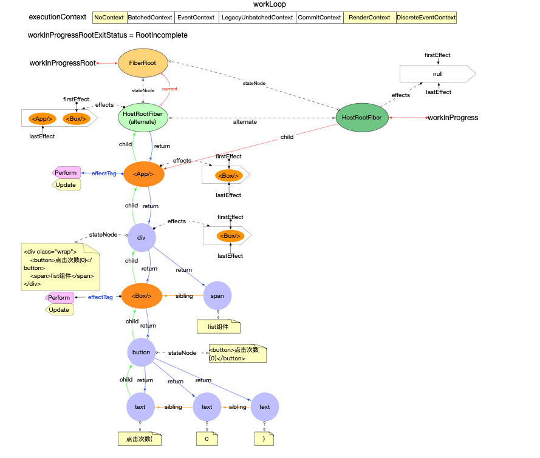
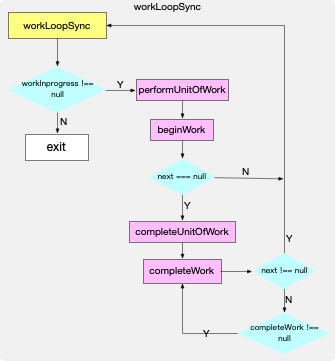

# react 更新机制

在[React 应用初始化](./02-bootstrap)中介绍了`react`应用启动的 3 种模式.为了简便, 这里在`legacy`模式为前提之下进行讨论. 对于`concurrent`和`blocking`的讨论, 在`任务分片`中详细展开.

正常 react 应用有 3 种主动更新方式:

1. `Class`组件中主动调用`setState`.
2. `Function`组件中使用`hook`对象的`dispatchAction`.
3. 改变`context`

## setState

继续使用[首次 render](./03-render-process)中的例子.

定义`<App/>`组件的结构如下:

```js
class App extends React.Component {
  componentDidMount() {
    console.log('App componentDidMount');
  }
  render() {
    return (
      <div class="wrap">
        <Box />
        <span>list组件</span>
      </div>
    );
  }
}
class Box extends React.Component {
  state = {
    count: 0,
  };
  handleClick = () => {
    this.setState(state => {
      return {
        count: ++state.count,
      };
    });
  };
  componentDidMount() {
    console.log('Box componentDidMount');
  }
  render() {
    return (
      <button onClick={this.handleClick}>点击次数({this.state.count})</button>
    );
  }
}
```

在初次`render`结束后, 工作空间的主要变量的状态如下:


### 环境准备

从[合成事件](./04-syntheticEvent#事件触发)中对事件触发的分析得知, `onClick`事件对应的`listener`是`dispatchDiscreteEvent`.

所以在执行`handleClick`回调之前, 可以明确当前环境:

1. 工作空间(`ReactFiberWorkLoop`)执行上下文: `excutionContext |= DiscreteEventContext`
2. 调度(`Scheduler`)优先级: `currentPriorityLevel = UserBlockingPriority`

### 调度更新

点击`button`,触发合成事件,最后在`handleClick`中执行`setState`. 跟踪`setState`函数的调用栈:

在`Component`对象的原型中有:

```js
Component.prototype.setState = function(partialState, callback) {
  this.updater.enqueueSetState(this, partialState, callback, 'setState');
};
```

在[首次 render](./03-render-process#beginWork)中的`beginWork`阶段, class 类型的组件初始化完成之后, `this.updater`对象如下:

```js
const classComponentUpdater = {
  isMounted,
  enqueueSetState(inst, payload, callback) {
    // 1. 获取class实例对应的Fiber节点
    const fiber = getInstance(inst);
    // 2. 创建update对象
    // 2.1 计算本次更新的过期时间expirationTime
    const currentTime = requestCurrentTimeForUpdate();
    const suspenseConfig = requestCurrentSuspenseConfig();
    // legacy下expirationTime = Sync
    const expirationTime = computeExpirationForFiber(
      currentTime,
      fiber,
      suspenseConfig,
    );
    // 2.1 根据当前时间和过期时间, 创建update对象
    const update = createUpdate(currentTime, expirationTime, suspenseConfig);
    update.payload = payload;
    if (callback !== undefined && callback !== null) {
      update.callback = callback;
    }
    // 3. 将update对象添加到当前Fiber节点的updateQueue队列当中
    enqueueUpdate(fiber, update);
    // 4. 在当前Fiber节点上进行调度更新
    scheduleUpdateOnFiber(fiber, expirationTime);
  },
};
```

核心步骤:

1. 获取`class`实例对应的`Fiber`节点
2. 创建`update`对象
3. 将`update`对象添加到当前 Fiber 节点的`updateQueue`队列当中
4. 调用`scheduleUpdateOnFiber`, 从当前节点调度更新

#### scheduleUpdateOnFiber

```js
export function scheduleUpdateOnFiber(
  fiber: Fiber,
  expirationTime: ExpirationTime,
) {
  const root = markUpdateTimeFromFiberToRoot(fiber, expirationTime);
  if (expirationTime === Sync) {
    // leagcy下, expirationTime = Sync
    if (
      (executionContext & LegacyUnbatchedContext) !== NoContext &&
      (executionContext & (RenderContext | CommitContext)) === NoContext
    ) {
      // ... 第一次render进入
    } else {
      // 更新时进入
      ensureRootIsScheduled(root);
      schedulePendingInteractions(root, expirationTime);
      if (executionContext === NoContext) {
        flushSyncCallbackQueue();
      }
    }
  }
}
```

#### markUpdateTimeFromFiberToRoot


1. 从当前 fiber 节点开始, 向上查找直到`HostRootFiber`, 标记当前`fiber.expirationTime`
2. 标记所有父节点(包括 alternate)的`childExpirationTime`
3. 设置`fiberRoot`上的`pendingTime`和`suspendedTime`(非`legacy`模式下会使用)

#### ensureRootIsScheduled

通过[Scheduler 调度机制](./05-scheduler)的分析, legacy 下`ensureRootIsScheduled`是对`performSyncWorkOnRoot`进行包装.

#### performSyncWorkOnRoot

`performSyncWorkOnRoot`,的流程可以参照[首次 render](./03-render-process#从FiberRoot节点开始进行更新)中的流程:


和[首次 render](./03-render-process#从FiberRoot节点开始进行更新)比较的异同点如下:

相同点:

1. 调用`renderRootSync`生成新的`fiber`树
2. `fiberRoot.finishedWork`上挂载最新的`fiber`树
3. `fiberRoot`传入`commitWork`函数, 最终更新`DOM`
   不同点:
4. `renderRootSync`内部生成`fiber`的逻辑不同

```js
function performSyncWorkOnRoot(root) {
  let expirationTime;
  // legacy下 expirationTime = Sync;
  expirationTime = Sync;
  // 1. update阶段生成新的fiber树
  let exitStatus = renderRootSync(root, expirationTime);
  // 2. 设置root.finishedWork为最新的fiber树
  const finishedWork: Fiber = (root.current.alternate: any);
  root.finishedWork = finishedWork;
  root.finishedExpirationTime = expirationTime;
  root.nextKnownPendingLevel = getRemainingExpirationTime(finishedWork);
  // 3. 执行commit阶段
  commitRoot(root);
  // 4. 请求调度
  ensureRootIsScheduled(root);
  return null;
}
```

#### renderRootSync

```js
function renderRootSync(root, expirationTime) {
  // 1. 设置执行上下文
  const prevExecutionContext = executionContext;
  executionContext |= RenderContext;
  if (root !== workInProgressRoot || expirationTime !== renderExpirationTime) {
    // 2. 重置工作空间(workloop)中全局变量
    prepareFreshStack(root, expirationTime);
    startWorkOnPendingInteractions(root, expirationTime);
  }
  do {
    try {
      // 3. 执行同步工作循环
      workLoopSync();
      break;
    } catch (thrownValue) {
      handleError(root, thrownValue);
    }
  } while (true);
  executionContext = prevExecutionContext;
  workInProgressRoot = null;
  return workInProgressRootExitStatus;
}
```

#### prepareFreshStack

重置工作空间(workloop)中全局变量之后, 工作空间如下表示:



注意:

1. `fiberRoot.current`指向的是当前 dom 对应的 fiber 树
2. `workInProgress`指向`fiberRoot.current.alternate`称为`HostRootFiber(alternate)`
3. `workInProgress`在`prepareFreshStack`后会切换 fiber 树(切换到`alternate`分支)
4. `HostRootFiber(alternate).child`指向`HostRootFiber.child`

#### workLoopSync

`workLoopSync`和[首次 render](./03-render-process#workLoopSync)中的`workLoopSync`逻辑是一致的, 核心流程:



进入具体的`fiber`更新流程:

#### beginWork

```js
// 省略部分代码
function beginWork(
  current: Fiber | null,
  workInProgress: Fiber,
  renderExpirationTime: ExpirationTime,
): Fiber | null {
  const updateExpirationTime = workInProgress.expirationTime;
  if (current !== null) {
    const oldProps = current.memoizedProps;
    const newProps = workInProgress.pendingProps;
    if (
      oldProps !== newProps ||
      hasLegacyContextChanged() ||
      // Force a re-render if the implementation changed due to hot reload:
      (__DEV__ ? workInProgress.type !== current.type : false)
    ) {
      // If props or context changed, mark the fiber as having performed work.
      // This may be unset if the props are determined to be equal later (memo).
      didReceiveUpdate = true;
    } else if (updateExpirationTime < renderExpirationTime) {
      didReceiveUpdate = false;
      // ...
      return bailoutOnAlreadyFinishedWork(
        current,
        workInProgress,
        renderExpirationTime,
      );
    } else {
      didReceiveUpdate = false;
    }
  } else {
    didReceiveUpdate = false;
  }

  workInProgress.expirationTime = NoWork;

  switch (workInProgress.tag) {
    case ClassComponent: {
      const Component = workInProgress.type;
      const unresolvedProps = workInProgress.pendingProps;
      const resolvedProps =
        workInProgress.elementType === Component
          ? unresolvedProps
          : resolveDefaultProps(Component, unresolvedProps);
      return updateClassComponent(
        current,
        workInProgress,
        Component,
        resolvedProps,
        renderExpirationTime,
      );
    }
    case HostRoot:
      return updateHostRoot(current, workInProgress, renderExpirationTime);
    case HostComponent:
      return updateHostComponent(current, workInProgress, renderExpirationTime);
    case HostText:
      return updateHostText(current, workInProgress);
  }
}
```

核心流程:


1. 如果`current`指针存在
   1. `workInProgress`有更新(`props`或`context`有变动), 调用`updateXXXComponent`
   2. `workInProgress`没有更新, 调用`bailoutOnAlreadyFinishedWork`
      - 通过`childExpirationTime`判断子节点是否有更新, 如果有更新则调用`cloneChildFibers(current,workInProgress)`,将 current 的子节点 clone 到 workInProgress 中
2. 如果`current`指针为 null(初次`render`), 调用`updateXXXComponent`

#### completeWork
