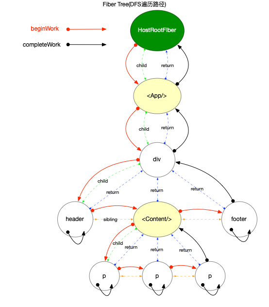

# React 算法之深度优先遍历

对于树或图结构的搜索(或遍历), 分为深度优先(DFS)和广度优先(BFS).

## 概念

深度优先遍历: DFS(英语:Depth-First-Search,DFS)是一种用于遍历或搜索树或图的算法.

来自 wiki 上的解释(更权威): 当`节点v`的所在边都己被探寻过, 搜索将回溯到发现`节点v`的那条边的起始节点. 这一过程一直进行到已发现从源节点可达的所有节点为止. 如果还存在未被发现的节点, 则选择其中一个作为源节点并重复以上过程, 整个进程反复进行直到所有节点都被访问为止.

## 实现方式

DFS 的主流实现方式有 2 种.

1. 递归(简单粗暴)
2. 利用`栈`存储遍历路径

3. 使用递归调用

```js
function Node() {
  this.name = '';
  this.children = [];
}

function dfs(node) {
  console.log('探寻阶段: ', node.name);
  node.children.forEach(child => {
    dfs(child);
  });
  console.log('回溯阶段: ', node.name);
}
```

2. 使用栈

```js
function Node() {
  this.name = '';
  this.children = [];

  // 因为要分辨探寻阶段和回溯阶段, 所以必须要一个属性来记录是否已经访问过该节点
  // 如果不打印探寻和回溯, 就不需要此属性
  this.visited = false;
}

function dfs(node) {
  const stack = [];
  stack.push(node);
  // 栈顶元素还存在, 就继续循环
  while ((node = stack[stack.lenth - 1])) {
    if (node.visited) {
      console.log('回溯阶段: ', node.name);
      // 回溯完成, 弹出该元素
      stack.pop();
    } else {
      console.log('探寻阶段: ', node.name);
      node.visited = true;
      // 利用栈的先进后出的特性, 倒序将节点送入栈中
      for (let i = node.children.length - 1; i >= 0; i--) {
        stack.push(node.children[i]);
      }
    }
  }
}
```

## React 当中的使用场景

深度优先遍历在`react`当中的使用非常典型, 最主要的使用时在`ReactElement`和`fiber`树的构造过程. 其次是在使用`context`时, 需要深度优先地查找消费`context`的节点.

### ReactElement "树"的构造

`ReactElement`不能算是严格的树结构, 为了方便表述, 后文都称之为树.

在`react-reconciler`包中, `ReactElement`的构造过程实际上也是`reconciler`调和过程. 与`fiber`树的构造是相互交替, 逐级进行的(在`fiber 树构建`章节中详细解读, 本节只介绍深度优先遍历的使用场景).

`ReactElement`树的构造, 实际上就是各级组件`render`之后的总和. 整个过程体现在`reconciler`工作循环之中.

源码位于[`ReactFiberWorkLoop.js`](https://github.com/facebook/react/blob/v17.0.1/packages/react-reconciler/src/ReactFiberWorkLoop.old.js#L1558)中, 此处为了简明, 已经将源码中与 dfs 无关的旁支逻辑去掉.

```js
function workLoopSync() {
  // 1. 最外层循环, 保证每一个节点都能遍历, 不会遗漏
  while (workInProgress !== null) {
    performUnitOfWork(workInProgress);
  }
}

function performUnitOfWork(unitOfWork: Fiber): void {
  const current = unitOfWork.alternate;
  let next;
  // 2. beginWork是向下探寻阶段
  next = beginWork(current, unitOfWork, subtreeRenderLanes);
  if (next === null) {
    // 3. completeUnitOfWork 是回溯阶段
    completeUnitOfWork(unitOfWork);
  } else {
    workInProgress = next;
  }
}

function completeUnitOfWork(unitOfWork: Fiber): void {
  let completedWork = unitOfWork;
  do {
    const current = completedWork.alternate;
    const returnFiber = completedWork.return;
    let next;
    // 3.1 回溯并处理节点
    next = completeWork(current, completedWork, subtreeRenderLanes);
    if (next !== null) {
      // 判断在处理节点的过程中, 是否派生出新的节点
      workInProgress = next;
      return;
    }
    const siblingFiber = completedWork.sibling;
    // 3.2 判断是否有旁支
    if (siblingFiber !== null) {
      workInProgress = siblingFiber;
      return;
    }
    // 3.3 没有旁支 继续回溯
    completedWork = returnFiber;
    workInProgress = completedWork;
  } while (completedWork !== null);
}
```

以上源码本质上是采用递归的方式进行 dfs, 假设有以下  组件结构:

```jsx
class App extends React.Component {
  render() {
    return (
      <div className="app">
        <header>header</header>
        <Content />
        <footer>footer</footer>
      </div>
    );
  }
}

class Content extends React.Component {
  render() {
    return (
      <React.Fragment>
        <p>1</p>
        <p>2</p>
        <p>3</p>
      </React.Fragment>
    );
  }
}

export default App;
```

则可以绘制出遍历路径如下:


注意:

- `ReactElement`树是在大循环中的`beginWork`阶段"逐级"生成的.
- "逐级"中的每一级是值一个`class`或`function`类型的组件, 每调用一次`render`或执行一次`function`调用, 就会生成一批`ReactElement`节点.
- `ReactElement`树的构造, 实际上就是各级组件`render`之后的总和.

### fiber 树的构造

在`ReactElement`的构造过程中, 同时伴随着`fiber`树的构造, `fiber`树同样也是在`beginWork`阶段生成的.

绘制出遍历路径如下:



### 查找 context 的消费节点

当`context`改变之后, 需要找出依赖该`context`的所有子节点(详细分析会在`context原理`章节深入解读), 这里同样也是一个`DFS`, 具体源码在[ReactFiberNewContext.js](https://github.com/facebook/react/blob/v17.0.1/packages/react-reconciler/src/ReactFiberNewContext.old.js#L182-L295).

将其主杆逻辑剥离出来, 可以清晰的看出采用循环递归的方式进行遍历:

```js
export function propagateContextChange(
  workInProgress: Fiber,
  context: ReactContext<mixed>,
  changedBits: number,
  renderLanes: Lanes,
): void {
  let fiber = workInProgress.child;
  while (fiber !== null) {
    let nextFiber;
    // Visit this fiber.
    const list = fiber.dependencies;
    if (list !== null) {
      // 匹配context等逻辑, 和dfs无关, 此处可以暂时忽略
      // ...
    } else {
      // 向下探寻
      nextFiber = fiber.child;
    }
    fiber = nextFiber;
  }
}
```

## 总结

由于`react`内部使用了`ReactElement`和`fiber`两大树形结构, 所以有不少关于节点访问的逻辑.

本节主要介绍了`DFS`的概念和它在`react`源码中的使用情况. 其中`fiber`树的`DFS`遍历, 涉及到的代码多, 分布广, 涵盖了`reconciler`阶段的大部分工作, 是`reconciler`阶段工作循环的核心流程.

除了`DFS`之外, 源码中还有很多逻辑都是查找树中的节点(如: 向上查找父节点等). 对树形结构的遍历在源码中的比例很高, 了解这些算法技巧能够更好的理解`react`源码.

## 参考资料

[深度优先搜索](https://zh.wikipedia.org/wiki/%E6%B7%B1%E5%BA%A6%E4%BC%98%E5%85%88%E6%90%9C%E7%B4%A2)
