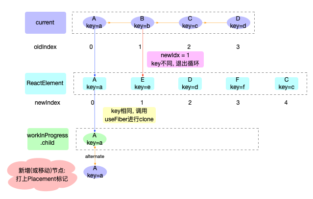
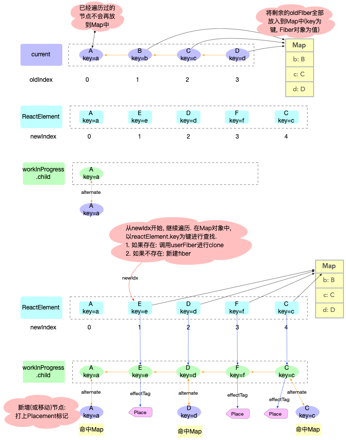

# React 算法之调和算法

## 概念

调和函数的作用:

1. 给新增和删除的`fiber`节点设置`effectTag`(打上副作用标记)
2. 如果是需要删除的`fiber`, 除了自身打上`effectTag`之外, 还要将其添加到父节点的`effects`链表中(因为该节点会脱离`fiber`树, 不会再进入`completeWork`阶段. 所以在`beginWork`阶段就要将其添加到父节点的`effects`链表中).

## 特性

算法复杂度低, 比较整个树形结构, 可以把时间复杂度缩短到 O(n)

## 基本使用

### 单节点比较

1. 调用`reconcileSingleElement`
   - 比较`oldfiber.key`和`reactElement.key`(单节点通常不显式设置 key, react 内部会设置成 null)
     - 如 key 相同, 进一步比较`fiber.elementType`与`newChild.type`.
       - 如 type 相同, 调用`useFiber`, 创建`oldFiber.alternate`,并返回
       - 如 type 不同, 调用`createFiber`创建新的`fiber`
     - 如 key 不同, 给`oldFiber`打上`Deletion`标记, 并创建新的`fiber`

### 多节点(数组类型, [Symbol.iterator]=fn,[@@iterator]=fn)

1. 进入第一次循环`newChildren: Array<*>`
   - 调用`updateSlot`(与`oldChildren`中相同`index`的`fiber`进行比较), 返回该槽位对应的`fiber`
     - 如 key 相同, 进一步比较`fiber.elementType`与`newChild.type`.
       - 如 type 相同, 调用`useFiber`进行 clone, 创建出`oldFiber.alternate`,并返回
       - 如 type 不同, 调用`createFiber`创建新的`fiber`
     - 如 key 不同, 则返回`null`
   - 调用`placeChild`
     - 设置`newFiber.index`
     - 如`newFiber`是新增节点或者是移动节点,则设置`newFiber.effectTag = Placement`
2. 如果`oldFiber === null`,则表示`newIdx`之后都为新增节点, 进入第二次循环`newChildren: Array<*>`
   - 调用`createChild`和`placeChild`.创建新节点并设置`newFiber.effectTag = Placement`
3. 将所有`oldFiber`以 key 为键,添加到一个`Map`中
4. 进入第三次循环`newChildren: Array<*>`
   - 调用`updateFromMap`,从 map 中寻找`key`相同的`fiber`进行创建`newFiber`
     - 调用`placeChild`
5. 为`Map`中的旧节点设置删除标记`childToDelete.effectTag = Deletion`

注意:

虽然有三次循环, 但指针都是`newIdx`, 时间复杂度是线性 O(n)

## 代码演示

有如下示例:

```jsx
import React, { useState } from 'react';

export default () => {
  const [list, setList] = useState([
    { key: 'a', value: 'A' },
    { key: 'a', value: 'B' },
    { key: 'a', value: 'C' },
    { key: 'a', value: 'D' },
  ]);
  return (
    <>
      <div className="wrap">
        {list.map(item => (
          <div key={item.key}>{item.value}</div>
        ))}
      </div>
      <button
        onClick={() => {
          setList([
            { key: 'a', value: 'A' },
            { key: 'e', value: 'E' },
            { key: 'd', value: 'D' },
            { key: 'f', value: 'F' },
            { key: 'c', value: 'C' },
          ]);
        }}
      >
        change
      </button>
    </>
  );
};
```

针对`div.wrap`节点展开讨论, 在点击`change`按钮之后, 更改`list`. `reconcileChildren`执行前后对比如下:


1. 新增节点和移动节点
   - 新增节点 E,F 都打上了`Placement`标记
   - C 节点不是新增节点,但是由于位置的移动,也打上了`Placement`标记
2. 删除节点
   - B 节点为删除节点,被打上了`Deletion`标记, 并且添加到父节点的副作用队列当中

具体比较过程:

1. 由于子节点是可迭代类型, 会调用`reconcileChildrenArray`.

进入调和函数之前, 先明确一下比较对象.是`fiber`对象和`pendingProps.children`对象(这里是`reactElement`对象,也有可能是字符串)进行比较,最终目的是为了生成`workInProgress.child`


2. 第一次循环



对应代码:

```js
for (; oldFiber !== null && newIdx < newChildren.length; newIdx++) {
  if (oldFiber.index > newIdx) {
    nextOldFiber = oldFiber;
    oldFiber = null;
  } else {
    nextOldFiber = oldFiber.sibling;
  }
  // new槽位和old槽位进行比较, 如果key不同, 返回null
  // key相同, 比较type是否一致. type一致则执行useFiber(update逻辑), type不一致则运行createXXX(insert逻辑)
  const newFiber = updateSlot(
    returnFiber,
    oldFiber,
    newChildren[newIdx],
    expirationTime,
  );
  // 如newFiber为空, 跳出循环
  if (newFiber === null) {
    if (oldFiber === null) {
      oldFiber = nextOldFiber;
    }
    break;
  }
  if (shouldTrackSideEffects) {
    // 若是新增节点, 则给老节点打上Deletion标记
    if (oldFiber && newFiber.alternate === null) {
      deleteChild(returnFiber, oldFiber);
    }
  }
  // 1. 设置newFiber.index = newIndex
  // 2. 给newFiber打Placement标记(新增节点或新旧index不同才会标记Placement)
  // 3. 返回: 新增或移动返回lastPlacedIndex, 原地不动返回oldIndex
  lastPlacedIndex = placeChild(newFiber, lastPlacedIndex, newIdx);
  if (previousNewFiber === null) {
    resultingFirstChild = newFiber;
  } else {
    previousNewFiber.sibling = newFiber;
  }
  previousNewFiber = newFiber;
  oldFiber = nextOldFiber;
}
```

2. 第二次循环

> 针对第一次循环完成之后, newChildren 还未完全遍历, 表明 newIdx 之后都是新增节点. 后续节点都走新增流程

对应代码:

```js
if (oldFiber === null) {
  for (; newIdx < newChildren.length; newIdx++) {
    const newFiber = createChild(
      returnFiber,
      newChildren[newIdx],
      expirationTime,
    );
    if (newFiber === null) {
      continue;
    }
    lastPlacedIndex = placeChild(newFiber, lastPlacedIndex, newIdx);
    if (previousNewFiber === null) {
      // TODO: Move out of the loop. This only happens for the first run.
      resultingFirstChild = newFiber;
    } else {
      previousNewFiber.sibling = newFiber;
    }
    previousNewFiber = newFiber;
  }
  return resultingFirstChild;
}
```

由于本例子是有节点移动的情况, 所以第一次循环并不会完全执行就会跳出, 故不会进入到第二次循环.

3. 第三次循环



对应代码:

```js
// Add all children to a key map for quick lookups.
const existingChildren = mapRemainingChildren(returnFiber, oldFiber);

// Keep scanning and use the map to restore deleted items as moves.
for (; newIdx < newChildren.length; newIdx++) {
  const newFiber = updateFromMap(
    existingChildren,
    returnFiber,
    newIdx,
    newChildren[newIdx],
    expirationTime,
  );
  if (newFiber !== null) {
    if (shouldTrackSideEffects) {
      if (newFiber.alternate !== null) {
        // The new fiber is a work in progress, but if there exists a
        // current, that means that we reused the fiber. We need to delete
        // it from the child list so that we don't add it to the deletion
        // list.
        existingChildren.delete(newFiber.key === null ? newIdx : newFiber.key);
      }
    }
    lastPlacedIndex = placeChild(newFiber, lastPlacedIndex, newIdx);
    if (previousNewFiber === null) {
      resultingFirstChild = newFiber;
    } else {
      previousNewFiber.sibling = newFiber;
    }
    previousNewFiber = newFiber;
  }
}
```

4. 标记删除的节点


对应代码:

```js
if (shouldTrackSideEffects) {
  // Any existing children that weren't consumed above were deleted. We need
  // to add them to the deletion list.
  existingChildren.forEach(child => deleteChild(returnFiber, child));
}
```
