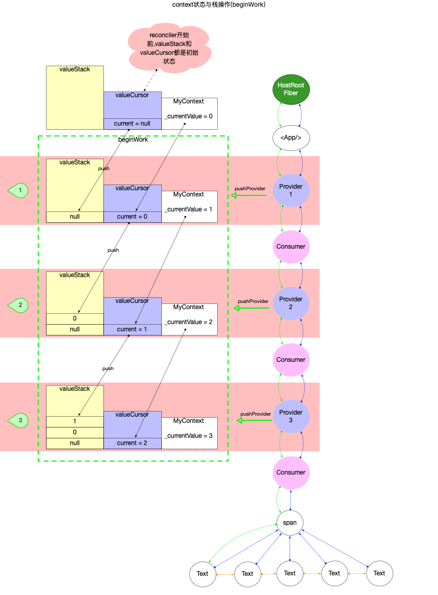
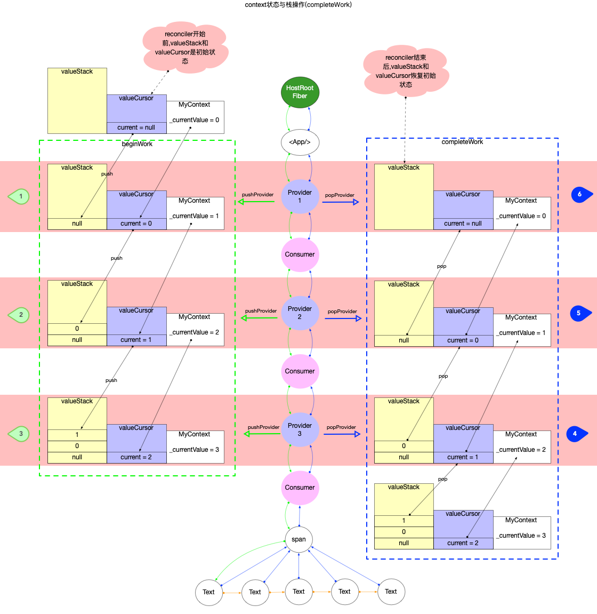

# React 算法之栈操作

## 概念

来自 wiki 上的解释: `堆栈`(`stack`)又称为`栈`或`堆叠`, 是计算机科学中的一种抽象资料类型, 只允许在有序的线性资料集合的一端(称为堆栈顶端`top`)进行加入数据(`push`)和移除数据(`pop`)的运算. 因而按照后进先出(`LIFO, Last In First Out`)的原理运作.

注意:

- `栈`(stack)又叫做`堆栈`, 这里特指数据结构中的`栈`(另一种`程序内存分配`中的栈, 本系列不做介绍, 读者可自行了解).
- `堆栈`中虽带有一个`堆`字, 只是命名, 不要和`堆`混淆.
- 常说的`堆`有 2 种指代, 一种是`数据结构`中的堆(在[React 算法之堆排序](./heapsort.md)中有介绍), 另一种是`程序内存分配`中的堆(本系列不做介绍, 读者可自行了解).

## 特性

1. 先入后出, 后入先出.
2. 除头尾节点之外, 每个元素有一个前驱, 一个后继.

## 基本使用

1. 压栈: `push()`
2. 弹栈: `pop((`
3. 预览栈顶元素: `peek()`

```js
class Stack {
  constructor() {
    this.dataStore = [];
    this.top = 0;
  }

  // 压栈
  push(element) {
    this.dataStore[this.top++] = element;
  }

  // 弹栈
  pop() {
    return this.dataStore[--this.top];
  }

  // 预览栈顶元素
  peek() {
    return this.dataStore[this.top - 1];
  }

  // 检测栈内存储了多少个元素
  length() {
    return this.top;
  }

  // 清空栈
  clear() {
    this.top = 0;
  }
}
```

测试代码:

```js
const test = () => {
  const stack = new Stack();
  console.log('压栈a: ');
  stack.push('a');
  console.log('压栈b: ');
  stack.push('b');
  console.log('压栈c: ');
  stack.push('c');
  console.log('栈高度: ', stack.length());
  console.log('栈顶元素: ', stack.peek());
  console.log('弹出: ', stack.pop());
  console.log('栈顶元素: ', stack.peek());
  console.log('压栈d: ');
  stack.push('d');
  console.log('栈顶元素: ', stack.peek());
  console.log('清空栈: ');
  stack.clear();
  console.log('栈高度: ', stack.length());
  console.log('压栈e: ');
  stack.push('e');
  console.log('栈顶元素: ', stack.peek());
};
```

利用栈先进后出的特性, 在实际编码中应用非常广泛. 如`回溯`,`递归`,`深度优先搜索`等经典算法都可以利用栈的特性来实现. 由于本文的目的是讲解栈`react`中的使用场景, 所以与栈相关的经典案例本文不再列举, 请读者移步其他算法资料.

## React 当中的使用场景

### Context 状态管理 {#context}

在`fiber`树创建过程中, 如果使用了[`Context api`](https://zh-hans.reactjs.org/docs/context.html#reactcreatecontext)(具体来说是使用`Context.Provider`, `Class.contextType`, `Context.Consumer`等`api`), `react`内部会维护一个`栈`来保存提供者(`Context.Provider`)的状态, 供给消费者(`Context.Consumer`)使用.

首先看`stack`的定义([ReactFiberStack.js](https://github.com/facebook/react/blob/v17.0.1/packages/react-reconciler/src/ReactFiberStack.old.js#L10-L71)中):

```js
export type StackCursor<T> = {| current: T |};

// 维护一个全局stack
const valueStack: Array<any> = [];
let index = -1;

// 一个工厂函数, 创建StackCursor对象
function createCursor<T>(defaultValue: T): StackCursor<T> {
  return {
    current: defaultValue,
  };
}
function isEmpty(): boolean {
  return index === -1;
}
// 出栈
function pop<T>(cursor: StackCursor<T>, fiber: Fiber): void {
  if (index < 0) {
    return;
  }
  cursor.current = valueStack[index];
  valueStack[index] = null;
  index--;
}
// 入栈
function push<T>(cursor: StackCursor<T>, value: T, fiber: Fiber): void {
  index++;
  // 注意: 这里存储的是 cursor当前值, 随后更新了cursor.current为
  valueStack[index] = cursor.current;
  cursor.current = value;
}
```

在`ReactFiberStack.js`源码中, 定义的`valueStack`作为全局变量, 用来存储所有的`StackCursor.current`(不仅仅存储`context api`相关的`StackCursor`, 在`context 原理`章节中详细解读, 本节只讨论与`contex api`相关的栈操作).

注意`StackCursor`是一个泛型对象, 与`context api`相关的`StackCursor`定义在[`ReactFiberNewContext.js`](https://github.com/facebook/react/blob/v17.0.1/packages/react-reconciler/src/ReactFiberNewContext.old.js#L38):

```js
// 定义全局 valueCursor, 用于管理<Context.Provider/>组件的value
const valueCursor: StackCursor<mixed> = createCursor(null);

// ...省略无关代码

// 将context当前的值保存到valueCursor中, 并设置context._currentValue为最新值
// 运行完成之后context为最新状态
export function pushProvider<T>(providerFiber: Fiber, nextValue: T): void {
  const context: ReactContext<T> = providerFiber.type._context;
  push(valueCursor, context._currentValue, providerFiber);
  context._currentValue = nextValue;
}

// 取出valueCursor中保存的旧值, 设置到context._currentValue上.
// 运行完成之后context恢复到上一个状态
export function popProvider(providerFiber: Fiber): void {
  const currentValue = valueCursor.current;
  pop(valueCursor, providerFiber);
  const context: ReactContext<any> = providerFiber.type._context;
  context._currentValue = currentValue;
}
```

假设有如下组件结构(平时开发很难有这样的代码, 此处完全是为了演示`context api`中涉及到的栈操作):

```js
const MyContext = React.createContext(0);

export default function App() {
  return (
    // 第一级
    <MyContext.Provider value={1}>
      <MyContext.Consumer>
        {value1 => (
          //第二级嵌套
          <MyContext.Provider value={2}>
            <MyContext.Consumer>
              {value2 => (
                // 第三级嵌套
                <MyContext.Provider value={3}>
                  <MyContext.Consumer>
                    {value3 => (
                      <span>
                        {value1}-{value2}-{value3}
                      </span>
                    )}
                  </MyContext.Consumer>
                </MyContext.Provider>
              )}
            </MyContext.Consumer>
          </MyContext.Provider>
        )}
      </MyContext.Consumer>
    </MyContext.Provider>
  );
}
```

可在`codesandbox`中查看[运行结果](https://codesandbox.io/s/inspiring-wildflower-lkpom?file=/src/App.js).

将`fiber`树构造过程中`MyContext`对象在栈中的变化情况表示出来:

1. `beginWork`阶段: 入栈

   - `reconciler`之前, 由于`const MyContext = React.createContext(0);`已经创建了`MyContext`对象, 所以其初始值是`0`.
   - `reconciler`过程中, 每当遇到`Context.Provider`类型的节点, 则会执行`pushProvider`.



2. `completeWork`阶段: 出栈
   - `reconciler`过程中, 每当遇到`Context.Provider`类型的节点, 则会执行`popProvider`.
   - `reconciler`之后, `valueStack`和`valueCursor`以及`MyContext`都恢复到了初始状态.



注意:

- 本节只分析`context`实现源码中与`栈`相关的部分, 所以只涉及到了`Context.Provider`(供应者)节点.
- 对于`Context.Consumer`(消费者)以及更新阶段`context`的运行机制的深入解读放在`context原理`章节中.

### executionContext 执行上下文

`executionContext`是在`ReactFiberWorkLoop.js`中定义的一个[全局变量(相对于该闭包)](https://github.com/facebook/react/blob/v17.0.1/packages/react-reconciler/src/ReactFiberWorkLoop.old.js#L247-L256), 且定义成二进制变量, 通过位运算来维护其状态(在[React 算法之位运算](./bitfiled.md)一文中已有介绍).

表面上看`executionContext`和栈并没有直接关系, 但实际在改变`executionContext`的时候, 巧妙的利用了`函数调用栈`, 实现`executionContext`状态的维护.

本节主要是体现`executionContext`和`函数调用栈`之间的配合运用([具体源码](https://github.com/facebook/react/blob/v17.0.1/packages/react-reconciler/src/ReactFiberWorkLoop.old.js#L1117-L1207)), 这里以`batchedUpdates`和`unbatchedUpdates`为例进行分析.

```js
export function batchedUpdates<A, R>(fn: A => R, a: A): R {
  // 在执行回调之前, 先改变 executionContext
  const prevExecutionContext = executionContext;
  executionContext |= BatchedContext;
  try {
    return fn(a);
  } finally {
    // 回调执行完毕之后, 再恢复到以前的值 prevExecutionContext
    executionContext = prevExecutionContext;
    // ... 省略无关代码
  }
}

export function unbatchedUpdates<A, R>(fn: (a: A) => R, a: A): R {
  const prevExecutionContext = executionContext;
  executionContext &= ~BatchedContext;
  executionContext |= LegacyUnbatchedContext;
  try {
    return fn(a);
  } finally {
    executionContext = prevExecutionContext;
    // ... 省略无关代码
  }
}

// ... 省略其他函数
```

这些函数的共性:

1. 执行回调之前, 先保存当前值为`prevExecutionContext`, 再改变 `executionContext`.
2. 在执行回调`fn`期间, 无论函数`fn`调用栈有多深, 被改变过的`executionContext`始终有效.
3. 回调执行完毕之后, 恢复到以前的值 `prevExecutionContext`.

## 总结

本节主要介绍了`栈`在`react`源码中的使用情况. 涉及入栈出栈等基本操作(`Context` 状态管理), 以及对函数调用栈的巧妙运用(改变`executionContext`执行上下文).

由于`reconciler`过程是一个深度优先遍历过程, 对于`fiber树`来讲, 向下探寻(`beginWork`阶段)和向上回溯(`completeWork`阶段)天然就和栈的入栈(`push`)和出栈(`pop`)能够无缝配合(context 机制就是在这个特性上建立起来的).

## 参考资料

- [栈](https://blog.csdn.net/K346K346/article/details/80849966)
