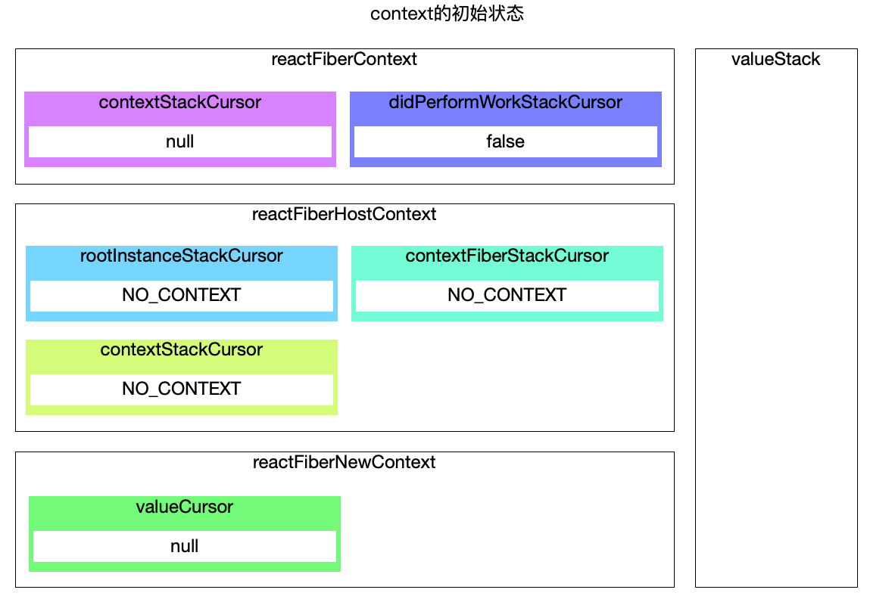

# React Context 机制

在前文中已经分析了[fiber 构建(新增节点)](./render.md)和[fiber 构建(更新节点)](./update.md). react 应用在 fiber 树的构建过程中, 同时也伴随对`context`的使用和管理. 本节重点分析`context`是如何运作的.

## 文件分布

在`react-reconciler`包中, 重点关注有 context 命名的 3 个文件.

1. [ReactFiberContext.js](https://github.com/facebook/react/blob/v16.13.1/packages/react-reconciler/src/ReactFiberContext.js). 从其中的函数可以看出, 该文件主要是处理`fiber`和`context`之间的关系.

2. [ReactFiberNewContext.js](https://github.com/facebook/react/blob/v16.13.1/packages/react-reconciler/src/ReactFiberNewContext.js). 该文件是处理最新的 context(通过`React.createContext`进行创建),不涉及[过时的 context](https://zh-hans.reactjs.org/docs/context.html#legacy-api). 其中的部分函数只在`concurrent`模式才会调用(可以先忽略, 不妨碍对 context 流程的分析).

3. [ReactFiberHostContext.js](https://github.com/facebook/react/blob/v16.13.1/packages/react-reconciler/src/ReactFiberHostContext.js). 该文件虽然以`context`命名, 但是和 react 中的`context api`没有关系, 主要是为了维护 DOM 节点的[Namespaces](https://infra.spec.whatwg.org/#namespaces)和 fiber 的对应关系.
   - 维护的`namespace`会在[创建 dom 节点](https://github.com/facebook/react/blob/v16.13.1/packages/react-dom/src/client/ReactDOMComponent.js#L384)的时候使用.
   - 大多数情况下都是`html namespace`.
   - 特殊情况: 比如引用了一个`svg`组件, 那么`svg`组件的所有子节点都必须是`svg namespace`.

这 3 个文件中, 真正和`react context`有关的只有前两个, 由于在 fiber 树的构建过程中对于这 3 个文件的使用方式非常相近(后文会体现, 都通过`valueStack`进行管理), 所以放在一起进行说明.

这 3 个文件都有一个共同的特点, 就是在文件开始定义了一些`StackCursor`类型的全局变量.

`ReactFiberContext.js`中:

```js
export const emptyContextObject = {};

// A cursor to the current merged context object on the stack.
// 管理当前合并后的context, 主要是涉及对过时context的兼容
let contextStackCursor: StackCursor<Object> = createCursor(emptyContextObject);
// A cursor to a boolean indicating whether the context has changed.
// 管理context是否改变
let didPerformWorkStackCursor: StackCursor<boolean> = createCursor(false);
// Keep track of the previous context object that was on the stack.
// We use this to get access to the parent context after we have already
// pushed the next context provider, and now need to merge their contexts.
let previousContext: Object = emptyContextObject;
```

`ReactFiberNewContext.js`中:

```js
// 管理 React.CreateContext()创建出来的context
const valueCursor: StackCursor<mixed> = createCursor(null);
```

`ReactFiberHostContext.js`中:

```js
const NO_CONTEXT: NoContextT = ({}: any);
// 管理namespaces
let contextStackCursor: StackCursor<HostContext | NoContextT> = createCursor(
  NO_CONTEXT,
);
// 管理fiber节点
let contextFiberStackCursor: StackCursor<Fiber | NoContextT> = createCursor(
  NO_CONTEXT,
);
// 管理根节点实例(dom对象)
let rootInstanceStackCursor: StackCursor<Container | NoContextT> = createCursor(
  NO_CONTEXT,
);
```

在[`ReactFiberStack.js`](https://github.com/facebook/react/blob/v16.13.1/packages/react-reconciler/src/ReactFiberStack.js#L12)中, 定义`StackCursor`, 并且维护了一个栈`valueStack`:

```js
export type StackCursor<T> = {| current: T |};

const valueStack: Array<any> = [];

let index = -1;

function createCursor<T>(defaultValue: T): StackCursor<T> {
  return {
    current: defaultValue,
  };
}

function pop<T>(cursor: StackCursor<T>, fiber: Fiber): void {
  if (index < 0) {
    return;
  }

  cursor.current = valueStack[index];

  valueStack[index] = null;

  index--;
}

function push<T>(cursor: StackCursor<T>, value: T, fiber: Fiber): void {
  index++;

  valueStack[index] = cursor.current;

  cursor.current = value;
}
```

## 内存结构

了解了文件分布, 和其中的数据结构之后, 从程序启动开始, 正式分析`react context`. 在[React 应用初始化](./bootstrap.md#调用更新入口)中已经分析, 无论使用哪种方式进行启动(或更新),都会调用[`updateContainer`](https://github.com/facebook/react/blob/v16.13.1/packages/react-reconciler/src/ReactFiberReconciler.js#L228)函数(位于`react-reconciler`包).

`updateContainer`

```js
// ... 函数中省略了与context无关代码
export function updateContainer(
  element: ReactNodeList,
  container: OpaqueRoot,
  parentComponent: ?React$Component<any, any>,
  callback: ?Function,
): ExpirationTime {
  const current = container.current; // current指向的是HostRootFiber(Fiber树的根节点)

  // 获取当前parentComponent上关联的context, 执行后返回emptyContextObject, 是一个{}
  const context = getContextForSubtree(parentComponent);
  if (container.context === null) {
    // 设置FiberRoot.context
    container.context = context;
  }

  // 调度和更新current(HostRootFiber)对象
  scheduleUpdateOnFiber(current, expirationTime);
  return expirationTime;
}
```

注意: `getContextForSubtree(parentComponent)`是获取当前 parentComponent 上关联的 context, 并且挂载到了`container(FiberRoot)`之上, 可以认为是一个全局变量, 初始值就是`emptyContextObject={}`, 之后会被送入到`valueStack`中管理.

接下来调用`scheduleUpdateOnFiber`(在[调度机制](./scheduler.md)中已经分析), 最后会进入`performSyncWorkOnRoot`进行 fiber 树的构建(详细过程可以查看[fiber 构建](./render.md).

在进入 fiber 构建之前, 内存中`StackCursor`和`valueStack`的状态如下:



## 调用过程

每一个 fiber 节点的创建, 都会经过`beginWork`和`completeWork`两个阶段, 同时伴随`context`的传递和使用.

**下文的重点都放在`context`的跟踪上, fiber 树的构建过程在前文中已有说明, 本文不再发散**

### context 数据结构

在进入 fiber 树构建之前, 先明确[`context`的数据结构](https://github.com/facebook/react/blob/v16.13.1/packages/react/src/ReactContext.js#L35).

```js
export function createContext<T>(
  defaultValue: T,
  calculateChangedBits: ?(a: T, b: T) => number,
): ReactContext<T> {
  if (calculateChangedBits === undefined) {
    calculateChangedBits = null;
  }
  const context: ReactContext<T> = {
    $$typeof: REACT_CONTEXT_TYPE,
    _calculateChangedBits: calculateChangedBits,
    // As a workaround to support multiple concurrent renderers, we categorize
    // some renderers as primary and others as secondary. We only expect
    // there to be two concurrent renderers at most: React Native (primary) and
    // Fabric (secondary); React DOM (primary) and React ART (secondary).
    // Secondary renderers store their context values on separate fields.
    _currentValue: defaultValue,
    _currentValue2: defaultValue,
    // Used to track how many concurrent renderers this context currently
    // supports within in a single renderer. Such as parallel server rendering.
    _threadCount: 0,
    // These are circular
    Provider: (null: any),
    Consumer: (null: any),
  };

  context.Provider = {
    $$typeof: REACT_PROVIDER_TYPE,
    _context: context,
  };

  context.Consumer = context;
  return context;
}
```

### 演示示例

示例代码(context 的嵌套消费)如下:

```jsx
import React from 'react';
// Theme context
const ThemeContext = React.createContext('default theme');

// User context
const UserContext = React.createContext({
  name: 'default name',
});

class App extends React.Component {
  state = {};
  changeUser = () => {
    this.setState({
      user: { name: `user ${Math.ceil(Math.random() * 100)}` },
    });
  };
  changeTheme = () => {
    this.setState({
      theme: `theme ${Math.ceil(Math.random() * 100)}`,
    });
  };
  render() {
    const {
      user = { name: 'initial user' },
      theme = 'initial theme',
    } = this.state;

    // 提供初始 context 值的 App 组件
    return (
      <ThemeContext.Provider value={theme}>
        <UserContext.Provider value={user}>
          <Content
            onChangeUser={this.changeUser}
            onChangeTheme={this.changeTheme}
          />
        </UserContext.Provider>
      </ThemeContext.Provider>
    );
  }
}

class ThemedButton extends React.Component {
  static contextType = ThemeContext;
  showContext = () => {
    this.props.onClick();
  };
  render() {
    let theme = this.context;
    return <button>{theme}</button>;
  }
}

// 一个组件嵌套消费多个 context
function Content(props) {
  return (
    <ThemeContext.Consumer>
      {theme => (
        <UserContext.Consumer>
          {user => (
            <>
              <div>user: {JSON.stringify(user)}</div>
              <button onClick={props.onChangeUser}>{user.name}</button>
              <div>theme: {theme}</div>
              <ThemedButton onClick={props.onChangeTheme} />
            </>
          )}
        </UserContext.Consumer>
      )}
    </ThemeContext.Consumer>
  );
}

export default App;
```

根据示例代码可以提取出来和`context`有关的 fiber 节点, 对与这些节点进行分析.

1. `HostRootFiber`对应`updateHostRoot`
2. `ThemeContext.Provider`对应`updateContextProvider`, 提供`ThemeContext`
3. `UserContext.Provider`对应`updateContextProvider`, 提供`UserContext`
4. `Content`对应`updateClassComponent`
5. `ThemeContext.Consumer`对应`updateContext`, 消费`ThemeContext`
6. `UserContext.Consumer`对应`updateContext`, 消费`UserContext`
7. `ThemedButton`对应`updateClassComponent`, 消费`ThemeContext`

其余节点(如 div,button 等`HostComponent`类型的节点)不会直接访问`context`, 其所有属性都通过父组件的`props`传入, 这类组件没有生产和控制`props`的能力, 也不会感知到`props`属性的来源, 只需要按照`props`进行更新就行.

### [beginWork](https://github.com/facebook/react/blob/v16.13.1/packages/react-reconciler/src/ReactFiberBeginWork.js#L2874)阶段

1. [updateHostRoot](https://github.com/facebook/react/blob/v16.13.1/packages/react-reconciler/src/ReactFiberBeginWork.js#L987)

```js
// 省略和context无关的代码
function updateHostRoot(current, workInProgress, renderExpirationTime) {
  pushHostRootContext(workInProgress);
  //...
}

function pushHostRootContext(workInProgress) {
  const root = (workInProgress.stateNode: FiberRoot);
  if (root.pendingContext) {
    pushTopLevelContextObject(
      workInProgress,
      root.pendingContext,
      root.pendingContext !== root.context,
    );
  } else if (root.context) {
    // Should always be set
    pushTopLevelContextObject(workInProgress, root.context, false);
  }
  pushHostContainer(workInProgress, root.containerInfo);
}
```

可以看到在`updateHostRoot`函数开始调用`pushHostRootContext`对相关的`StackCursor`进行入栈操作.

2. updateContextProvider(ThemeContext.Provider), 提供`ThemeContext`
3. updateContextProvider(UserContext.Provider), 提供`UserContext`
4. updateClassComponent(Content)
5. updateContext(ThemeContext.Consumer), 消费`ThemeContext`
6. updateContext(UserContext.Consumer), 消费`UserContext`
7. updateClassComponent(ThemedButton), 消费`ThemeContext`

### [completeWork]()阶段

7. updateClassComponent(ThemedButton), 消费`ThemeContext`
8. updateContext(UserContext.Consumer), 消费`UserContext`
9. updateContext(ThemeContext.Consumer), 消费`ThemeContext`
10. updateClassComponent(Content)
11. updateContextProvider(UserContext.Provider), 提供`UserContext`
12. updateContextProvider(ThemeContext.Provider), 提供`ThemeContext`
13. updateHostRoot(HostRootFiber)
    ...
