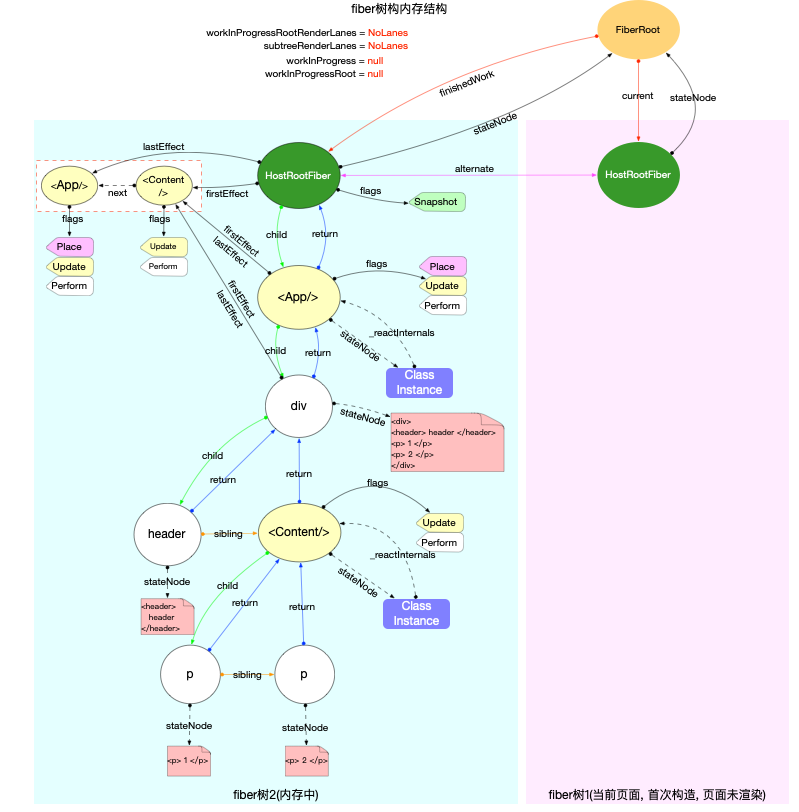
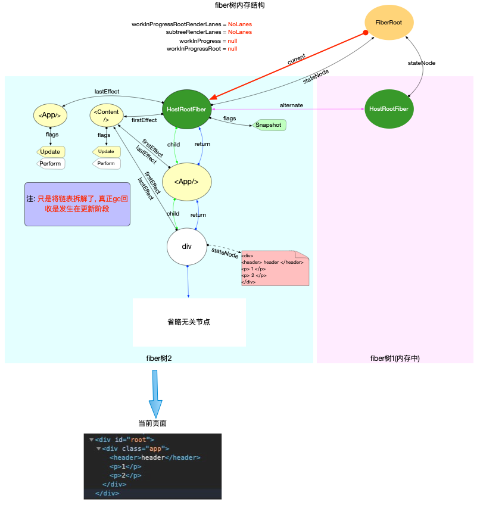

# fiber 树渲染

在正式分析`fiber树渲染`之前, 再次回顾一下[reconciler 运作流程](./reconciler-workflow.md)的 4 个阶段:


1. 输入阶段: 衔接`react-dom`包, 承接`fiber更新`请求(参考[React 应用的启动过程](./bootstrap.md)).
2. 注册调度任务: 与调度中心(`scheduler`包)交互, 注册调度任务`task`, 等待任务回调(参考[React 调度原理(scheduler)](./scheduler.md)).
3. 执行任务回调: 在内存中构造出`fiber树`和`DOM`对象(参考[fiber 树构造(初次创建)](./fibertree-create.md)和 fiber 树构造(对比更新)).
4. 输出: 与渲染器(`react-dom`)交互, 渲染`DOM`节点.

本节分析其中的第 4 阶段(输出), `fiber树渲染`处于`reconciler 运作流程`这一流水线的最后一环, 或者说前面的步骤都是为了最后一步服务, 所以其重要性不言而喻.

前文已经介绍了`fiber树构造`, 现在分析`fiber树渲染`过程, 这个过程, 实际上是对`fiber树`的进一步处理.

## fiber 树特点

通过前文`fiber树构造`的解读, 可以总结出`fiber树`的基本特点:

- 无论是`首次构造`或者是`对比更新`, 最终都会在内存中生成一棵用于渲染页面的`fiber树`(即`fiberRoot.finishedWork`).
- 这棵将要被渲染的`fiber树`有 2 个特点:
  1.  副作用队列挂载在根节点上(具体来讲是`finishedWork.firstEffect`)
  2.  代表最新页面的`DOM`对象挂载在`fiber树`中首个`HostComponent`类型的节点上(具体来讲`DOM`对象是挂载在`fiber.stateNode`属性上)

这里再次回顾前文使用过的 2 棵 fiber 树, 可以验证上述特点:

1. 初次构造



2. 对比更新

图暂缺, 只是为了说明无论是初次构造还是对比更新,在 commit 阶段实际处理的只有副作用队列和 dom 对象.

## commitRoot

整个渲染逻辑都在[commitRoot 函数中](https://github.com/facebook/react/blob/v17.0.1/packages/react-reconciler/src/ReactFiberWorkLoop.old.js#L1879-L2254):

```js
function commitRoot(root) {
  const renderPriorityLevel = getCurrentPriorityLevel();
  runWithPriority(
    ImmediateSchedulerPriority,
    commitRootImpl.bind(null, root, renderPriorityLevel),
  );
  return null;
}
```

在`commitRoot`中同时使用到了`渲染优先级`和`调度优先级`, 有关优先级的讨论, 在前文已经做出了说明(参考[React 中的优先级管理](./priority.md)和[fiber 树构造(基础准备)#优先级](./fibertree-prepare.md#优先级)), 本节不再赘述. 最后的实现是通过`commitRootImpl`函数:

```js
// ... 省略部分无关代码
function commitRootImpl(root, renderPriorityLevel) {
  // ============ 渲染前: 准备 ============

  const finishedWork = root.finishedWork;
  const lanes = root.finishedLanes;

  // 清空FiberRoot对象上的属性
  root.finishedWork = null;
  root.finishedLanes = NoLanes;
  root.callbackNode = null;

  if (root === workInProgressRoot) {
    // 重置全局变量
    workInProgressRoot = null;
    workInProgress = null;
    workInProgressRootRenderLanes = NoLanes;
  }

  // 再次更新副作用队列
  let firstEffect;
  if (finishedWork.flags > PerformedWork) {
    // 默认情况下fiber节点的副作用队列是不包括自身的
    // 如果根节点有副作用, 则将根节点添加到副作用队列的末尾
    if (finishedWork.lastEffect !== null) {
      finishedWork.lastEffect.nextEffect = finishedWork;
      firstEffect = finishedWork.firstEffect;
    } else {
      firstEffect = finishedWork;
    }
  } else {
    firstEffect = finishedWork.firstEffect;
  }

  // ============ 渲染 ============
  let firstEffect = finishedWork.firstEffect;
  if (firstEffect !== null) {
    const prevExecutionContext = executionContext;
    executionContext |= CommitContext;
    // 阶段1: dom突变之前
    nextEffect = firstEffect;
    do {
      commitBeforeMutationEffects();
    } while (nextEffect !== null);

    // 阶段2: dom突变, 界面发生改变
    nextEffect = firstEffect;
    do {
      commitMutationEffects(root, renderPriorityLevel);
    } while (nextEffect !== null);
    // 恢复界面状态
    resetAfterCommit(root.containerInfo);
    // 切换current指针
    root.current = finishedWork;

    // 阶段3: layout阶段, 调用生命周期componentDidUpdate和回调函数等
    nextEffect = firstEffect;
    do {
      commitLayoutEffects(root, lanes);
    } while (nextEffect !== null);
    nextEffect = null;
    executionContext = prevExecutionContext;
  }

  // ============ 渲染后: 重置与清理 ============
  if (rootDoesHavePassiveEffects) {
    // 有被动作用(使用useEffect), 保存一些全局变量
  } else {
    // 分解副作用队列链表, 辅助垃圾回收
    // 如果有被动作用(使用useEffect), 会把分解操作放在flushPassiveEffects函数中
    nextEffect = firstEffect;
    while (nextEffect !== null) {
      const nextNextEffect = nextEffect.nextEffect;
      nextEffect.nextEffect = null;
      if (nextEffect.flags & Deletion) {
        detachFiberAfterEffects(nextEffect);
      }
      nextEffect = nextNextEffect;
    }
  }
  // 重置一些全局变量(省略这部分代码)...
  // 下面代码用于检测是否有新的更新任务
  // 比如在componentDidMount函数中, 再次调用setState()

  // 1. 检测常规(异步)任务, 如果有则会发起异步调度(调度中心`scheduler`只能异步调用)
  ensureRootIsScheduled(root, now());
  // 2. 检测同步任务, 如果有则主动调用flushSyncCallbackQueue(无需再次等待scheduler调度), 再次进入fiber树构造循环
  flushSyncCallbackQueue();

  return null;
}
```

`commitRootImpl`函数中, 可以根据是否调用渲染, 把整个`commitRootImpl`分为 3 段(分别是`渲染前`, `渲染`, `渲染后`).

### 渲染前

为接下来正式渲染, 做一些准备工作. 主要包括:

1. 设置全局状态(如: 更新`fiberRoot`上的属性)
2. 重置全局变量(如: `workInProgressRoot`, `workInProgress`等)
3. 再次更新副作用队列: 只针对根节点`fiberRoot.finishedWork`
   - 默认情况下根节点的副作用队列是不包括自身的, 如果根节点有副作用, 则将根节点添加到副作用队列的末尾
   - 注意只是延长了副作用队列, 但是`fiberRoot.lastEffect`指针并没有改变.
     比如首次构造时, 根节点拥有`Snapshot`标记:


### 渲染

`commitRootImpl`函数中, 渲染阶段的主要逻辑是处理副作用队列, 将最新的 DOM 节点(已经在内存中, 只是还没渲染)渲染到界面上.

整个渲染过程被分为 3 个函数分布实现:

1. `commitBeforeMutationEffects`
   - dom 变更之前, 处理副作用队列中带有`Snapshot`,`Passive`标记的`fiber`节点.
2. `commitMutationEffects`
   - dom 变更, 界面得到更新. 处理副作用队列中带有`Placement`, `Update`, `Deletion`, `Hydrating`标记的`fiber`节点.
3. `commitLayoutEffects`
   - dom 变更后, 处理副作用队列中带有`Update | Callback`标记的`fiber`节点.

通过上述源码分析, 可以把`commitRootImpl`的职责概括为 2 个方面:

1. 处理副作用队列. (步骤 1,2,3 都会处理, 只是处理节点的标识`fiber.flags`不同).
2. 调用渲染器, 输出最终结果. (在步骤 2: `commitMutationEffects`中执行).

所以`commitRootImpl`是处理`fiberRoot.finishedWork`这棵即将被渲染的`fiber`树, 理论上无需关心这棵`fiber`树是如何产生的(可以是`首次构造`产生, 也可以是`对比更新`产生). 为了清晰简便, 在下文的所有图示都使用`初次创建的fiber树结构`来进行演示.

这 3 个函数处理的对象是`副作用队列`和`DOM对象`.

所以无论`fiber树`结构有多么复杂, 到了`commitRoot`阶段, 实际起作用的只有 2 个节点:

- `副作用队列`所在节点: 根节点, 即`HostRootFiber`节点.
- `DOM对象`所在节点: 从上至下首个`HostComponent`类型的`fiber`节点, 此节点 `fiber.stateNode`实际上指向最新的 DOM 树.

下图为了清晰, 省略了一些无关引用, 只留下`commitRoot`阶段实际会用到的`fiber`节点:


#### commitBeforeMutationEffects

第一阶段: dom 变更之前, 处理副作用队列中带有`Snapshot`,`Passive`标记的`fiber`节点.

```js
// ... 省略部分无关代码
function commitBeforeMutationEffects() {
  while (nextEffect !== null) {
    const current = nextEffect.alternate;
    const flags = nextEffect.flags;
    // 处理`Snapshot`标记
    if ((flags & Snapshot) !== NoFlags) {
      commitBeforeMutationEffectOnFiber(current, nextEffect);
    }
    // 处理`Passive`标记
    if ((flags & Passive) !== NoFlags) {
      // Passive标记只在使用了hook, useEffect会出现. 所以此处是针对hook对象的处理
      if (!rootDoesHavePassiveEffects) {
        rootDoesHavePassiveEffects = true;
        scheduleCallback(NormalSchedulerPriority, () => {
          flushPassiveEffects();
          return null;
        });
      }
    }
    nextEffect = nextEffect.nextEffect;
  }
}
```

1. 处理`Snapshot`标记

```js
function commitBeforeMutationLifeCycles(
  current: Fiber | null,
  finishedWork: Fiber,
): void {
  switch (finishedWork.tag) {
    case FunctionComponent:
    case ForwardRef:
    case SimpleMemoComponent:
    case Block: {
      return;
    }
    case ClassComponent: {
      if (finishedWork.flags & Snapshot) {
        if (current !== null) {
          const prevProps = current.memoizedProps;
          const prevState = current.memoizedState;
          const instance = finishedWork.stateNode;

          const snapshot = instance.getSnapshotBeforeUpdate(
            finishedWork.elementType === finishedWork.type
              ? prevProps
              : resolveDefaultProps(finishedWork.type, prevProps),
            prevState,
          );
          instance.__reactInternalSnapshotBeforeUpdate = snapshot;
        }
      }
      return;
    }
    case HostRoot: {
      if (supportsMutation) {
        if (finishedWork.flags & Snapshot) {
          const root = finishedWork.stateNode;
          clearContainer(root.containerInfo);
        }
      }
      return;
    }
    case HostComponent:
    case HostText:
    case HostPortal:
    case IncompleteClassComponent:
      return;
  }
}
```

从源码中可以看到, 与`Snapshot`标记相关的类型只有`ClassComponent`和`HostRoot`.

- 对于`ClassComponent`类型节点, 调用了`instance.getSnapshotBeforeUpdate`生命周期函数
- 对于`HostRoot`类型节点, 调用`clearContainer`清空了容器节点(即`div#root`这个 dom 节点).

2. 处理`Passive`标记

`Passive`标记只会在使用了`hook`对象的`function`类型的节点上存在, 后续的执行过程在`hook原理`章节中详细说明. 此处我们需要了解在`commitRoot`的第一个阶段, 为了处理`hook`对象(如`useEffect`), 通过`scheduleCallback`单独注册了一个调度任务`task`, 等待调度中心`scheduler`处理.

注意: 通过调度中心`scheduler`调度的任务`task`均是通过`MessageChannel`触发, 都是异步执行(可参考[React 调度原理(scheduler)](./scheduler.md)).

小测试:

```js
// 以下示例代码中的输出顺序为 1, 3, 4, 2
function Test() {
  console.log(1);
  useEffect(() => {
    console.log(2);
  });
  console.log(3);
  Promise.resolve(() => {
    console.log(4);
  });
  return <div>test</div>;
}
```

#### commitMutationEffects

第二阶段: dom 变更, 界面得到更新. 处理副作用队列中带有`ContentReset`, `Ref`, `Placement`, `Update`, `Deletion`, `Hydrating`标记的`fiber`节点.

```js
// ...省略部分无关代码
function commitMutationEffects(
  root: FiberRoot,
  renderPriorityLevel: ReactPriorityLevel,
) {
  // 处理Ref
  if (flags & Ref) {
    const current = nextEffect.alternate;
    if (current !== null) {
      // 先清空ref, 在commitRoot的第三阶段(dom变更后), 再重新赋值
      commitDetachRef(current);
    }
  }
  // 处理DOM突变
  while (nextEffect !== null) {
    const flags = nextEffect.flags;
    const primaryFlags = flags & (Placement | Update | Deletion | Hydrating);
    switch (primaryFlags) {
      case Placement: {
        // 新增节点
        commitPlacement(nextEffect);
        nextEffect.flags &= ~Placement; // 注意Placement标记会被清除
        break;
      }
      case PlacementAndUpdate: {
        // Placement
        commitPlacement(nextEffect);
        nextEffect.flags &= ~Placement;
        // Update
        const current = nextEffect.alternate;
        commitWork(current, nextEffect);
        break;
      }
      case Update: {
        // 更新节点
        const current = nextEffect.alternate;
        commitWork(current, nextEffect);
        break;
      }
      case Deletion: {
        // 删除节点
        commitDeletion(root, nextEffect, renderPriorityLevel);
        break;
      }
    }
    nextEffect = nextEffect.nextEffect;
  }
}
```

处理 DOM 突变:

1. `新增`: 函数调用栈 `commitPlacement` -> `insertOrAppendPlacementNode` -> `appendChild`
2. `更新`: 函数调用栈 `commitWork` -> `commitUpdate`
3. `删除`: 函数调用栈 `commitDeletion` -> `removeChild`

最终会调用`appendChild, commitUpdate, removeChild`这些`react-dom`包中的函数. 它们是[`HostConfig`协议](https://github.com/facebook/react/blob/v17.0.1/packages/react-reconciler/README.md#practical-examples)([源码在 ReactDOMHostConfig.js 中](https://github.com/facebook/react/blob/v17.0.1/packages/react-dom/src/client/ReactDOMHostConfig.js))中规定的标准函数, 在渲染器`react-dom`包中进行实现. 这些函数就是直接操作 DOM, 所以执行之后, 界面也会得到更新.

注意: `commitMutationEffects`执行之后, 在`commitRootImpl`函数中切换当前`fiber`树(`root.current = finishedWork`),保证`fiberRoot.current`指向代表当前界面的`fiber树`.


#### commitLayoutEffects

第三阶段: dom 变更后, 处理副作用队列中带有`Update, Callback, Ref`标记的`fiber`节点.

```js
// ...省略部分无关代码
function commitLayoutEffects(root: FiberRoot, committedLanes: Lanes) {
  while (nextEffect !== null) {
    const flags = nextEffect.flags;
    // 处理 Update和Callback标记
    if (flags & (Update | Callback)) {
      const current = nextEffect.alternate;
      commitLayoutEffectOnFiber(root, current, nextEffect, committedLanes);
    }
    if (flags & Ref) {
      // 重新设置ref
      commitAttachRef(nextEffect);
    }
    nextEffect = nextEffect.nextEffect;
  }
}
```

核心逻辑都在`commitLayoutEffectOnFiber->commitLifeCycles`函数中.

```js
// ...省略部分无关代码
function commitLifeCycles(
  finishedRoot: FiberRoot,
  current: Fiber | null,
  finishedWork: Fiber,
  committedLanes: Lanes,
): void {
  switch (finishedWork.tag) {
    case ClassComponent: {
      const instance = finishedWork.stateNode;
      if (finishedWork.flags & Update) {
        if (current === null) {
          // 初次渲染: 调用 componentDidMount
          instance.componentDidMount();
        } else {
          const prevProps =
            finishedWork.elementType === finishedWork.type
              ? current.memoizedProps
              : resolveDefaultProps(finishedWork.type, current.memoizedProps);
          const prevState = current.memoizedState;
          // 更新阶段: 调用 componentDidUpdate
          instance.componentDidUpdate(
            prevProps,
            prevState,
            instance.__reactInternalSnapshotBeforeUpdate,
          );
        }
      }
      const updateQueue: UpdateQueue<
        *,
      > | null = (finishedWork.updateQueue: any);
      if (updateQueue !== null) {
        // 处理update回调函数 如: this.setState({}, callback)
        commitUpdateQueue(finishedWork, updateQueue, instance);
      }
      return;
    }
    case HostComponent: {
      const instance: Instance = finishedWork.stateNode;
      if (current === null && finishedWork.flags & Update) {
        const type = finishedWork.type;
        const props = finishedWork.memoizedProps;
        // 设置focus等原生状态
        commitMount(instance, type, props, finishedWork);
      }
      return;
    }
  }
}
```

在`commitLifeCycles`函数中:

- 对于`ClassComponent`节点, 调用生命周期函数`componentDidMount`或`componentDidUpdate`, 调用`update.callback`回调函数.
- 对于`HostComponent`节点, 如有`Update`标记, 需要设置一些原生状态(如: `focus`等)

### 渲染后

执行完上述步骤之后, 本次渲染任务就已经完成了. 在渲染完成后, 需要做一些重置和清理工作:

1. 清除副作用队列

   - 由于副作用队列是一个链表, 由于单个`fiber`对象的引用关系, 无法被`gc回收`.
   - 将链表全部拆开, 当`fiber`对象不再使用的时候, 可以被`gc回收`.



2. 检测更新
   - 在整个渲染过程中, 有可能产生新的`update`(比如在`componentDidMount`函数中, 再次调用`setState()`).
   - 如果是常规(异步)任务, 不用特殊处理, 调用`ensureRootIsScheduled`确保任务已经注册到调度中心即可.
   - 如果是同步任务, 则主动调用`flushSyncCallbackQueue`(无需再次等待 scheduler 调度), 再次进入 fiber 树构造循环

```js
// 清除副作用队列
if (rootDoesHavePassiveEffects) {
  // 有被动作用(使用useEffect), 保存一些全局变量
} else {
  // 分解副作用队列链表, 辅助垃圾回收.
  // 如果有被动作用(使用useEffect), 会把分解操作放在flushPassiveEffects函数中
  nextEffect = firstEffect;
  while (nextEffect !== null) {
    const nextNextEffect = nextEffect.nextEffect;
    nextEffect.nextEffect = null;
    if (nextEffect.flags & Deletion) {
      detachFiberAfterEffects(nextEffect);
    }
    nextEffect = nextNextEffect;
  }
}
// 重置一些全局变量(省略这部分代码)...
// 下面代码用于检测是否有新的更新任务
// 比如在componentDidMount函数中, 再次调用setState()

// 1. 检测常规(异步)任务, 如果有则会发起异步调度(调度中心`scheduler`只能异步调用)
ensureRootIsScheduled(root, now());
// 2. 检测同步任务, 如果有则主动调用flushSyncCallbackQueue(无需再次等待scheduler调度), 再次进入fiber树构造循环
flushSyncCallbackQueue();
```

## 总结

本节分析了`fiber 树渲染`的处理过程, 从宏观上看`fiber 树渲染`位于`reconciler 运作流程`中的输出阶段, 是整个`reconciler 运作流程`的链路中最后一环(从输入到输出). 本节根据源码, 具体从`渲染前, 渲染, 渲染后`三个方面分解了`commitRootImpl`函数. 其中最核心的`渲染`逻辑又分为了 3 个阶段, 这 3 个阶段共同处理了副作用队列中被标记的`fiber`节点, 并通过渲染器`react-dom`把最新的 DOM 对象渲染到界面上.
