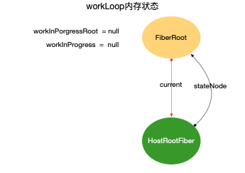

# fiber 树构造(初次创建)

在 React 运行时中, `fiber树构造`位于`react-reconciler`包.

在正式解读`fiber树构造`之前, 再次回顾一下[reconciler 运作流程](./reconciler-workflow.md)的 4 个阶段:


1. 输入阶段: 衔接`react-dom`包, 承接`fiber更新`请求(可以参考[React 应用的启动过程](./bootstrap.md)).
2. 注册调度任务: 与调度中心(`scheduler`包)交互, 注册调度任务`task`, 等待任务回调(可以参考[React 调度原理(scheduler)](./scheduler.md)).
3. 执行任务回调: 在内存中构造出`fiber树`和`DOM`对象, 也是**本节的重点类容**.
4. 输出: 与渲染器(`react-dom`)交互, 渲染`DOM`节点.

`fiber树构造`处于上述第 3 个阶段, 可以通过不同的视角来理解`fiber树构造`在`React`运行时中所处的位置:

- 从`scheduler`调度中心的角度来看, 它是任务队列`taskQueue`中的一个具体的任务回调(`task.callback`).
- 从[React 工作循环](./workloop.md)的角度来看, 它属于`fiber树构造循环`.

由于`fiber 树构造`源码量比较大, 本系列根据`React`运行的`内存状态`, 分为 2 种情况来说明:

1. 初次创建: 在`React`应用首次启动时, 界面还没有渲染, 此时并不会进入对比过程, 相当于直接构造一颗全新的树.
2. 对比更新: `React`应用启动后, 界面已经渲染. 如果再次发生更新, 创建`新fiber`之前需要和`旧fiber`进行对比. 最后构造的 fiber 树有可能是全新的, 也可能是部分更新的.

注意: `初次创建`相对于`对比更新`要简单很多(不涉及优先级和属性比较). 本节只讨论`初次创建`这种情况, 为了控制篇幅并突出`fiber 树构造`过程, 后文会在`Legacy`模式下进行分析.

示例代码如下([codesandbox](https://codesandbox.io/s/modest-kilby-iri6g?file=/src/App.js)):

```js
class App extends React.Component {
  render() {
    return (
      <div className="app">
        <header>header</header>
        <Content />
        <footer>footer</footer>
      </div>
    );
  }
}

class Content extends React.Component {
  render() {
    return (
      <React.Fragment>
        <p>1</p>
        <p>2</p>
        <p>3</p>
      </React.Fragment>
    );
  }
}
export default App;
```

## 基础准备

### ReactElement, Fiber, DOM 对象

在[React 应用中的高频对象](./object-structure.md)一文中, 已经介绍了`ReactElement`和`Fiber`对象的数据结构. 这里我们梳理出`ReactElement, Fiber, DOM`这 3 种对象的关系

1. [ReactElement 对象](https://github.com/facebook/react/blob/v17.0.1/packages/react/src/ReactElement.js#L126-L146)(type 定义在[shared 包中](https://github.com/facebook/react/blob/v17.0.1/packages/shared/ReactElementType.js#L15))

   - 所有采用`jsx`语法书写的节点, 都会被编译器转换, 最终会以`React.createElement(...)`的方式, 创建出来一个与之对应的`ReactElement`对象

2. [Fiber 对象](https://github.com/facebook/react/blob/v17.0.1/packages/react-reconciler/src/ReactFiber.old.js#L116-L155)(type 类型的定义在[ReactInternalTypes.js](https://github.com/facebook/react/blob/v17.0.1/packages/react-reconciler/src/ReactInternalTypes.js#L47-L174)中)

   - 一个`Fiber对象`代表一个即将渲染或者已经渲染的组件(`ReactElement`), 一个组件可能对应多个 fiber(current 和 WorkInProgress)

3. [DOM 对象](https://developer.mozilla.org/zh-CN/docs/Web/API/Document_Object_Model): 文档对象模型
   - `DOM`将文档解析为一个由节点和对象（包含属性和方法的对象）组成的结构集合, 也就是常说的`DOM树`.
   - `JavaScript`可以访问和操作存储在 DOM 中的内容, 也就是操作`DOM对象`, 进而触发 UI 渲染.

它们之间的关系反映了我们书写的 JSX 代码到 DOM 节点的转换过程:


注意:

- 开发人员能够控制的是`JSX`, 也就是`ReactElement`对象.
- `fiber树`是通过`ReactElement`生成的, 如果脱离了`ReactElement`,`fiber树`也无从谈起. 所以是`ReactElement`树(不是严格的树结构, 为了方便也称为树)驱动`fiber树`.
- `fiber树`是`DOM树`的数据模型, `fiber树`驱动`DOM树`

开发人员通过编程只能控制`ReactElement`树的结构, `ReactElement树`驱动`fiber树`, `fiber树`再驱动`DOM树`, 最后展现到页面上. 所以`fiber树`的构造过程, 实际上就是`ReactElement`对象到`fiber`对象的转换过程.

### 内存状态

<!-- 通过上文的回顾, `fiber树构造`并非一个独立的函数, 它处于`reconciler 运作流程`中的一环, 是任务队列`taskQueue`中的一个具体的任务回调(`task.callback`). 所以在正式执行`task.callback`时, 先要了解此时的上下文, 并梳理与`fiber树构造`相关的内存状态. -->

为了更简便的突出`fiber树构造`过程, 现以`Legacy模式`启动(因为只讨论`fiber树构造`原理, 其它模式与`Legacy`没有区别). 在前文[React 应用的启动过程](./bootstrap.md)中分析了 3 种启动模式的差异, 在进入`react-reconciler`包之前(调用`updateContainer`之前), 内存状态图如下:


然后进入`react-reconciler`包调用[updateContainer 函数](https://github.com/facebook/react/blob/v17.0.1/packages/react-reconciler/src/ReactFiberReconciler.old.js#L250-L321):

```js
// ... 省略了部分代码
export function updateContainer(
  element: ReactNodeList,
  container: OpaqueRoot,
  parentComponent: ?React$Component<any, any>,
  callback: ?Function,
): Lane {
  // 获取当前时间戳
  const current = container.current;
  const eventTime = requestEventTime();
  // 1. 创建一个优先级变量(车道模型)
  const lane = requestUpdateLane(current);

  // 2. 根据车道优先级, 创建update对象, 并加入fiber.updateQueue.pending队列
  const update = createUpdate(eventTime, lane);
  update.payload = { element };
  callback = callback === undefined ? null : callback;
  if (callback !== null) {
    update.callback = callback;
  }
  enqueueUpdate(current, update);

  // 3. 进入reconcier运作流程中的`输入`环节
  scheduleUpdateOnFiber(current, lane, eventTime);
  return lane;
}
```

`updateContainer`函数中做了 2 项初始化工作:

1. 创建优先级变量`lane`(参考[React 中的优先级管理](./priority.md)), `Legacy`模式下`lane=SyncLane`.
2. 创建`update`变量, 并添加到`HostRootFiber.updateQueue.shared.pending`队列中, 且`update.payload.element`指向了`ReactElement`对象`<App/>`.

此时相关的内存状态如下:


最后调用`scheduleUpdateOnFiber(current, lane, eventTime)`, 进入[reconcier 运作流程](./reconciler-workflow.md)中的`输入`环节.

## 构造过程

为了突出构造过程,排除干扰,先把内存状态图中的`FiberRoot`和`HostRootFiber`单独提出来(后文在此基础上添加):



在[scheduleUpdateOnFiber 函数](https://github.com/facebook/react/blob/v17.0.1/packages/react-reconciler/src/ReactFiberWorkLoop.old.js#L517-L619)中:

```js
// ...省略部分代码
export function scheduleUpdateOnFiber(
  fiber: Fiber,
  lane: Lane,
  eventTime: number,
) {
  // 标记优先级
  const root = markUpdateLaneFromFiberToRoot(fiber, lane);
  if (lane === SyncLane) {
    if (
      (executionContext & LegacyUnbatchedContext) !== NoContext &&
      (executionContext & (RenderContext | CommitContext)) === NoContext
    ) {
      // 首次渲染, 直接进行`fiber构造`
      performSyncWorkOnRoot(root);
    }
    // ...
  }
}
```

可以看到, 在`Legacy`模式下且首次渲染时, 有 2 个函数[markUpdateLaneFromFiberToRoot](https://github.com/facebook/react/blob/v17.0.1/packages/react-reconciler/src/ReactFiberWorkLoop.old.js#L625-L667)和[performSyncWorkOnRoot](https://github.com/facebook/react/blob/v17.0.1/packages/react-reconciler/src/ReactFiberWorkLoop.old.js#L965-L1045).

其中`markUpdateLaneFromFiberToRoot(fiber, lane)`函数在`fiber树构造(对比更新)`中才会发挥作用, 因为在`初次创建`时并没有形成`fiber树`, 所以核心代码并没有执行, 最后直接返回了`FiberRoot`对象.

`performSyncWorkOnRoot`看起来源码很多, 初次创建中真正用到的就 2 个函数:

```js
function performSyncWorkOnRoot(root) {
  let lanes;
  let exitStatus;
  if (
    root === workInProgressRoot &&
    includesSomeLane(root.expiredLanes, workInProgressRootRenderLanes)
  ) {
    // 初次构造时(因为root=fiberRoot, workInProgressRoot=null), 所以不会进入
  } else {
    // 1. 获取本次render的优先级, 初次构造返回 NoLanes
    lanes = getNextLanes(root, NoLanes);
    // 2. 从root节点开始, 至上而下更新
    exitStatus = renderRootSync(root, lanes);
  }
  // .. 后面的内容, 本节不讨论, 省略
}
```

其中`getNextLanes`返回最紧急的车道, 初次构造返回`NoLanes`.

[renderRootSync](https://github.com/facebook/react/blob/v17.0.1/packages/react-reconciler/src/ReactFiberWorkLoop.old.js#L1490-L1553)

```js
function renderRootSync(root: FiberRoot, lanes: Lanes) {
  const prevExecutionContext = executionContext;
  executionContext |= RenderContext;

  // 只要root节点或lanes有变动, 都会刷新渲染进度, 从根节点重新开始
  if (workInProgressRoot !== root || workInProgressRootRenderLanes !== lanes) {
    // legacy模式下都会进入
    prepareFreshStack(root, lanes);
    startWorkOnPendingInteractions(root, lanes);
  }

  do {
    try {
      workLoopSync();
      break;
    } catch (thrownValue) {
      handleError(root, thrownValue);
    }
  } while (true);

  executionContext = prevExecutionContext;

  // Set this to null to indicate there's no in-progress render.
  workInProgressRoot = null;
  workInProgressRootRenderLanes = NoLanes;

  return workInProgressRootExitStatus;
}
```

### 重要全局变量

### 循环构造

### 探寻阶段 beginWork

1. 创建`fiber`对象
2. 设置`fiber.flags`标志位

### 回溯阶段 completeWork

1. 创建`DOM`对象
2. 设置`fiber.flags`标志位
3. 拼接`Effect`作用链
