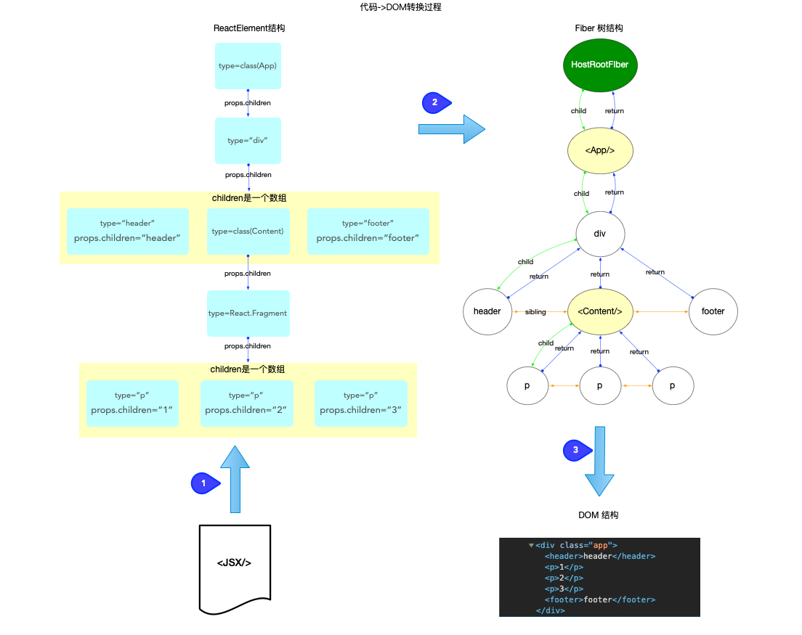

# 状态组件

## 概念

1. 组件

在 react 开发中所说的组件, 实际上指代的是[`ReactElement`对象](https://github.com/facebook/react/blob/v17.0.1/packages/react/src/ReactElement.js#L126-L146).
其数据结构如下:

```ts
  export type ReactElement = {|
    // 用于辨别ReactElement对象
    $$typeof: any,
    // 内部属性
    type: any, // 表明其种类
    key: any,
    ref: any,
    props: any
  |};
```

其中`type`属性决定了`ReactElement`的种类, 在`v17.0.1`中, [定义了 20 种](https://github.com/facebook/react/blob/v17.0.1/packages/shared/ReactSymbols.js#L16-L37)内部类型.

2. 状态组件

首先引入官网上对[状态组件的解释](https://zh-hans.reactjs.org/docs/faq-state.html), 官网上主要讲解了`class`组件内部用于维护状态的`props`和`state`属性. 从`v16.8`以后, 增加了`Hook`功能, 使得`function`组件也拥有维护局部状态的能力.

除此之外, [Context Api](https://zh-hans.reactjs.org/docs/context.html#api)定义了`Context.Provider`和`Context.Consumer`2 种组件, 其中`Context.Provider`也可以维护局部状态, 供给`Context.Consumer`使用.

广义上讲, 我们可以将`class`,`function`和`Context.Provider`这 3 类型的组件都归类为状态组件. 如果严格来讲, 只有`class`组件具备自身管理局部数据的能力, 其余两种(`function`和`Context.Provider`)都需要依赖其他条件.

注意: 本文只讨论`class`和`function`(因为它们的原理较为相似), 有关`Context`组件的状态管理单独在`Context原理`章节中讨论.

## 数据存储

首先我们可以回顾一下`ReactElement`, `Fiber`, `DOM`三者的关系(参考[fiber 树构造(基础准备)](./fibertree-prepare.md)). 简单来讲可以概括为`ReactElement树`驱动`fiber树`, `fiber树`再驱动`DOM树`, 最后展现到页面上. 下图可以简要表示这种驱动关系:



所以在使用层面, 开发者只能通过管理`JSX`代码逻辑(即控制`ReactElement`对象)来控制局部数据状态.

下面从`ReactElement`和`fiber`两个视角来分析数据存储

### ReactElement 视角

状态组件的实现方式:

1. `class组件`: 自身可以实现管理局部数据.
   - 通过`instance.state`存储局部数据.
   - 通过调用`instance.setState()`改变局部数据.
2. `function组件`: 实现数据管理需要依赖`Hook`对象.
   - 通过调用`const [state, dispatchAction] = useState()`创建一个`Hook`对象, 并把局部数据存储在`Hook`对象中.
   - 通过调用`dispatchAction()`改变`Hook`对象中保存的局部数据.

无论是`class组件`或`function组件`(也包括前文提到的`Context.Provider`组件), 虽然它们管理局部数据的实现方式不同, 但是局部数据存在的目的都是为了管控`fiber`子节点. 或者说`fiber`子节点是根据局部数据来生成的.

### fiber 视角

[fiber 数据结构](https://github.com/facebook/react/blob/v17.0.1/packages/react-reconciler/src/ReactInternalTypes.js#L47-L174)中, 有关局部状态的属性主要有 5 个(其余属性可以回顾[React 应用中的高频对象](./object-structure.md#Fiber)中的`Fiber 对象`小节中的介绍):

```ts
export type Fiber = {|
  stateNode: any,
  pendingProps: any,
  memoizedProps: any,
  updateQueue: mixed,
  memoizedState: any,
|};
```

1. `fiber.stateNode`: 与`fiber`关联的局部状态节点(比如: `HostComponent`类型指向与`fiber`节点对应的 dom 节点; 根节点`fiber.stateNode`指向的是`FiberRoot`; class 类型节点其`stateNode`指向的是 class 实例).
2. `fiber.pendingProps`: 输入属性, 从`ReactElement`对象传入的 props. 用于和`fiber.memoizedProps`比较可以得出属性是否变动.
3. `fiber.memoizedProps`: 上一次生成子节点时用到的属性, 生成子节点之后保持在内存中. 向下生成子节点之前叫做`pendingProps`, 生成子节点之后会把`pendingProps`赋值给`memoizedProps`用于下一次比较.`pendingProps`和`memoizedProps`比较可以得出属性是否变动.
4. `fiber.updateQueue`: 存储`update更新对象`的队列, 每一次发起更新, 都需要在该队列上创建一个`update对象`.
5. `fiber.memoizedState`: 上一次生成子节点之后保持在内存中的局部状态.

### class 类型的 fiber 节点

### function 类型的 fiber 节点

## 数据合并

## 总结
