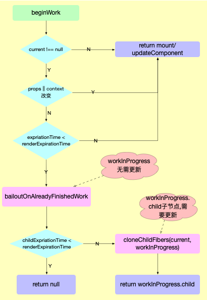
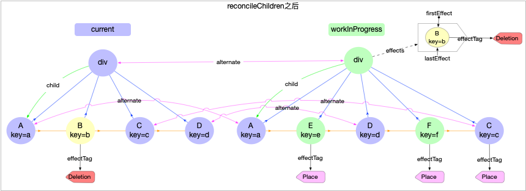
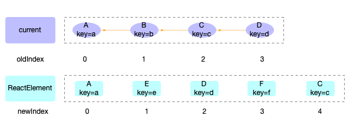
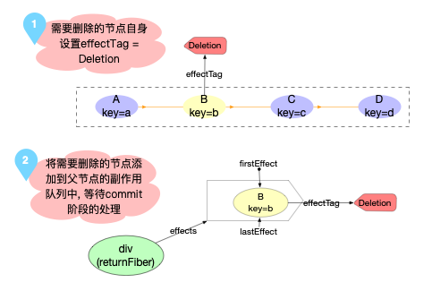

# React 更新机制

> 在[React 应用初始化](./bootstrap.md)中介绍了`react`应用启动的 3 种模式.为了简便, 本文在`legacy`模式下进行讨论. 对于`concurrent`和`blocking`的讨论, 在`任务分片机制`中详细展开.

如要主动发起更新, 有 3 种常见方式:

1. `Class`组件中调用`setState`.
2. `Function`组件中调用`hook`对象暴露出的`dispatchAction`.
3. 在`container`节点上重复调用`render`([官网示例](https://reactjs.org/docs/rendering-elements.html#react-only-updates-whats-necessary))

有如下示例代码:

```jsx
import React from 'react';
class App extends React.Component {
  render() {
    return (
      <>
        <Box />
        <Extra />
      </>
    );
  }
}
class Box extends React.Component {
  state = {
    count: 0,
  };
  handleClick = (...args) => {
    console.log(args);
    this.setState(state => {
      return {
        count: ++state.count,
      };
    });
  };
  componentDidMount() {
    console.log('Box componentDidMount');
  }
  render() {
    return (
      <button onClick={this.handleClick}>点击次数({this.state.count})</button>
    );
  }
}
class Extra extends React.Component {
  render() {
    return (
      <div className="extra">
        <div>Extra Content</div>
      </div>
    );
  }
}

export default App;
```

根据[首次 render](./render.md)中的分析, 初次`render`结束后, 可以得到`fiber`树形结构:


## 执行环境

从[合成事件](./synthetic-event.md#事件触发)中对事件触发的分析得知, `onClick`事件对应的`listener`是`dispatchDiscreteEvent`.

所以在执行`handleClick`回调之前, 可以明确当前环境:

1. 工作空间(`ReactFiberWorkLoop`)执行上下文: `excutionContext |= DiscreteEventContext`
2. 调度(`Scheduler`)优先级: `currentPriorityLevel = UserBlockingPriority`

## 发起更新

### setState

在`Component`对象的原型上挂载有`setState`:

```js
Component.prototype.setState = function(partialState, callback) {
  this.updater.enqueueSetState(this, partialState, callback, 'setState');
};
```

在[首次 render](./render.md#beginWork)中的`beginWork`阶段, class 类型的组件初始化完成之后, `this.updater`对象如下:

```js
const classComponentUpdater = {
  isMounted,
  enqueueSetState(inst, payload, callback) {
    // 1. 获取class实例对应的Fiber节点
    const fiber = getInstance(inst);
    // 2. 创建update对象
    // 2.1 计算本次更新的过期时间expirationTime
    const currentTime = requestCurrentTimeForUpdate();
    const suspenseConfig = requestCurrentSuspenseConfig();
    // legacy下expirationTime = Sync
    const expirationTime = computeExpirationForFiber(
      currentTime,
      fiber,
      suspenseConfig,
    );
    // 2.1 根据当前时间和过期时间, 创建update对象
    const update = createUpdate(currentTime, expirationTime, suspenseConfig);
    update.payload = payload;
    if (callback !== undefined && callback !== null) {
      update.callback = callback;
    }
    // 3. 将update对象添加到当前Fiber节点的updateQueue队列当中
    enqueueUpdate(fiber, update);
    // 4. 在当前Fiber节点上进行调度更新
    scheduleUpdateOnFiber(fiber, expirationTime);
  },
};
```

核心步骤:

1. 获取`class`实例对应的`Fiber`节点
2. 创建`update`对象
3. 将`update`对象添加到当前节点`fiber.updateQueue`队列当中
4. 调用`scheduleUpdateOnFiber`, 从当前节点调度更新

### dispatchAction

> 此处只是为了对比`dispatchAction`和`setState`. 对于`hook`对象的详细分析, 在[hook 原理](./hook.md)中详细讨论.

```js
function dispatchAction<S, A>(
  fiber: Fiber,
  queue: UpdateQueue<S, A>,
  action: A,
) {
  // 1. 获取expirationTime
  const currentTime = requestCurrentTimeForUpdate();
  const suspenseConfig = requestCurrentSuspenseConfig();
  const expirationTime = computeExpirationForFiber(
    currentTime,
    fiber,
    suspenseConfig,
  );
  // 2. 创建update对象
  const update: Update<S, A> = {
    expirationTime,
    suspenseConfig,
    action,
    eagerReducer: null,
    eagerState: null,
    next: (null: any),
  };
  //3. 将update对象设置到hook.queue队列当中
  const pending = queue.pending;
  if (pending === null) {
    update.next = update;
  } else {
    update.next = pending.next;
    pending.next = update;
  }
  queue.pending = update;
  //4. 请求调度
  scheduleUpdateOnFiber(fiber, expirationTime);
}
```

### 重复调用 render

```js
import ReactDOM from 'react-dom';
function tick() {
  const element = (
    <div>
      <h1>Hello, world!</h1>
      <h2>It is {new Date().toLocaleTimeString()}.</h2>
    </div>
  );
  ReactDOM.render(element, document.getElementById('root'));
}
setInterval(tick, 1000);
```

对于重复`render`, 在[初始化](./bootstrap.md#legacy模式)中已有说明, 实质调用`updateContainer`, 再结合[fiber 构建(新增节点)](./render.md)中对`updateContainer`的分析, 最终也是进入`scheduleUpdateOnFiber`.

> 可见无论用哪种方式发起更新. 最终都会进入`scheduleUpdateOnFiber`.

### scheduleUpdateOnFiber

```js
export function scheduleUpdateOnFiber(
  fiber: Fiber,
  expirationTime: ExpirationTime,
) {
  const root = markUpdateTimeFromFiberToRoot(fiber, expirationTime);
  if (expirationTime === Sync) {
    // leagcy下, expirationTime = Sync
    if (
      (executionContext & LegacyUnbatchedContext) !== NoContext &&
      (executionContext & (RenderContext | CommitContext)) === NoContext
    ) {
      // ... 第一次render进入
    } else {
      // 更新时进入
      ensureRootIsScheduled(root);
      schedulePendingInteractions(root, expirationTime);
      if (executionContext === NoContext) {
        flushSyncCallbackQueue();
      }
    }
  }
}
```

`scheduleUpdateOnFiber`在[fiber 构建(新增节点)](./render.md#执行调度)和[调度机制](./scheduler.md#)都有介绍, 是发起调度的入口函数.

其中`markUpdateTimeFromFiberToRoot`在更新阶段十分重要.

### markUpdateTimeFromFiberToRoot


1. 从当前 fiber 节点开始, 向上查找直到`HostRootFiber`, 标记当前`fiber.expirationTime`
2. 标记所有父节点(包括 alternate)的`childExpirationTime`
3. 设置`fiberRoot`上的`pendingTime`和`suspendedTime`(非`legacy`模式下会使用)

## 发起调度

### ensureRootIsScheduled

通过[调度机制](./scheduler.md)的分析, legacy 下`ensureRootIsScheduled`会设置`performSyncWorkOnRoot`回调.

### performSyncWorkOnRoot

`performSyncWorkOnRoot`的流程可以参照首次 render 中的流程:


```js
function performSyncWorkOnRoot(root) {
  let expirationTime;
  // legacy下 expirationTime = Sync;
  expirationTime = Sync;
  // 1. update阶段生成新的fiber树
  let exitStatus = renderRootSync(root, expirationTime);
  // 2. 设置root.finishedWork为最新的fiber树
  const finishedWork: Fiber = (root.current.alternate: any);
  root.finishedWork = finishedWork;
  root.finishedExpirationTime = expirationTime;
  root.nextKnownPendingLevel = getRemainingExpirationTime(finishedWork);
  // 3. 执行commit阶段
  commitRoot(root);
  // 4. 请求调度
  ensureRootIsScheduled(root);
  return null;
}
```

## 构建 fiber

### 指针介绍

在 fiber 构建过程中, 有两个全局变量非常重要. `current`和`workInProgress`可以看成是 2 个指针

1. `current`指针:

   - `current`指针指向当前页面上已经呈现出来的那个`fiber`, 所以在第一次 render 的时候它始终为 null
   - `current`指针所在的 fiber 树是当前页面正在使用的 fiber 树

2. `workInProgress`指针:
   - `workInProgress`指针指向当前内存中正在构造的`fiber`, 是一个未完成的`fiber`. 正在构造的 fiber 和已经在使用的 fiber 之间用`alternate`属性相互关联.
   - `workInProgress`指针所在的 fiber 树是正在构造的 fiber 树, 构造完成之后就会代替当前正在使用的 fiber 树

### renderRootSync

```js
function renderRootSync(root, expirationTime) {
  // 1. 设置执行上下文
  const prevExecutionContext = executionContext;
  executionContext |= RenderContext;
  if (root !== workInProgressRoot || expirationTime !== renderExpirationTime) {
    // 2. 重置工作空间(workloop)中全局变量
    prepareFreshStack(root, expirationTime);
    startWorkOnPendingInteractions(root, expirationTime);
  }
  do {
    try {
      // 3. 执行同步工作循环
      workLoopSync();
      break;
    } catch (thrownValue) {
      handleError(root, thrownValue);
    }
  } while (true);
  executionContext = prevExecutionContext;
  workInProgressRoot = null;
  return workInProgressRootExitStatus;
}
```

### prepareFreshStack

重置工作空间(workloop)中全局变量之后, 工作空间如下表示:


注意:

1. `fiberRoot.current`指向的是当前 dom 对应的 fiber 树
2. `workInProgress`指向`fiberRoot.current.alternate`称为`HostRootFiber(alternate)`
3. `workInProgress`在`prepareFreshStack`后会切换 fiber 树(切换到`alternate`分支)
4. `HostRootFiber(alternate).child`指向`HostRootFiber.child`

### workLoopSync

`workLoopSync`和[fiber 构建(新增节点)](./render.md#workLoopSync)中的`workLoopSync`逻辑是一致的, 核心流程:


进入具体的`fiber`更新流程:

### beginWork

```js
// 省略部分代码
function beginWork(
  current: Fiber | null,
  workInProgress: Fiber,
  renderExpirationTime: ExpirationTime,
): Fiber | null {
  const updateExpirationTime = workInProgress.expirationTime;
  if (current !== null) {
    const oldProps = current.memoizedProps;
    const newProps = workInProgress.pendingProps;
    if (
      oldProps !== newProps ||
      hasLegacyContextChanged() ||
      // Force a re-render if the implementation changed due to hot reload:
      (__DEV__ ? workInProgress.type !== current.type : false)
    ) {
      // If props or context changed, mark the fiber as having performed work.
      // This may be unset if the props are determined to be equal later (memo).
      didReceiveUpdate = true;
    } else if (updateExpirationTime < renderExpirationTime) {
      // 如果当前fiber没有变动, 其updateExpirationTime=NoWork=0, 必然会小于renderExpirationTime=Sync
      didReceiveUpdate = false;
      // 当前fiber没有变动, 调用bailoutOnAlreadyFinishedWork循环检测子节点是否需要更新
      return bailoutOnAlreadyFinishedWork(
        current,
        workInProgress,
        renderExpirationTime,
      );
    } else {
      didReceiveUpdate = false;
    }
  } else {
    didReceiveUpdate = false;
  }

  workInProgress.expirationTime = NoWork;

  switch (workInProgress.tag) {
    case ClassComponent: {
      const Component = workInProgress.type;
      const unresolvedProps = workInProgress.pendingProps;
      const resolvedProps =
        workInProgress.elementType === Component
          ? unresolvedProps
          : resolveDefaultProps(Component, unresolvedProps);
      return updateClassComponent(
        current,
        workInProgress,
        Component,
        resolvedProps,
        renderExpirationTime,
      );
    }
    case HostRoot:
      return updateHostRoot(current, workInProgress, renderExpirationTime);
    case HostComponent:
      return updateHostComponent(current, workInProgress, renderExpirationTime);
    case HostText:
      return updateHostText(current, workInProgress);
  }
}
```

核心流程:



1. 为了向下更新`workInProgress.child`节点(直到`workInProgress.child=null`), 最终形成完整的`fiber`树
2. 如果`current`指针存在(为更新节点), current 指向当前页面已经呈现出来的 dom 对象对应的 fiber
   1. `workInProgress`有更新(`props`或`context`有变动), 调用`update(mount)XXXComponent`
   2. `workInProgress`没有更新, 调用`bailoutOnAlreadyFinishedWork`
      - 通过`childExpirationTime`判断子节点是否有更新, 如果有更新则调用`cloneChildFibers(current,workInProgress)`返回`workInProgress.child`继续向下遍历. 如果没有更新则返回 null, 结束本路径的遍历.
3. 如果`current`指针为`null`(为新增节点), 调用`update(mount)XXXComponent`

### update(mount)XXXComponent

`update(mount)XXXComponent`总体分为两种情况

1. 继续向下构造`fiber`树

   - 调用`bailoutOnAlreadyFinishedWork`(当前节点无需更新, 如: `class`类型的节点且`shouldComponentUpdate`返回`false`. )
   - 调用`reconcileChildren`进入调和算法

2. 中断退出
   - 已经是末端节点(如`HostText`类型节点), 无需再往下更新

### 调和函数 reconcileChildren

调和函数目的:

1. 给新增和删除的`fiber`节点设置`effectTag`(打上副作用标记)
2. 如果是需要删除的`fiber`, 除了自身打上`effectTag`之外, 还要将其添加到父节点的`effects`链表中(因为该节点会脱离`fiber`树, 不会再进入`completeWork`阶段. 所以在`beginWork`阶段就要将其添加到父节点的`effects`链表中).

调和函数核心逻辑:

1. 单元素

   1. 调用`reconcileSingleElement`
      - 比较`oldfiber.key`和`reactElement.key`(单节点通常不显式设置 key, react 内部会设置成 null)
        - 如 key 相同, 进一步比较`fiber.elementType`与`newChild.type`.
          - 如 type 相同, 调用`useFiber`, 创建`oldFiber.alternate`,并返回
          - 如 type 不同, 调用`createFiber`创建新的`fiber`
        - 如 key 不同, 给`oldFiber`打上`Deletion`标记, 并创建新的`fiber`

2. 可迭代元素(数组类型, [Symbol.iterator]=fn,[@@iterator]=fn)
   1. 进入第一次循环`newChildren: Array<*>`
      - 调用`updateSlot`(与`oldChildren`中相同`index`的`fiber`进行比较), 返回该槽位对应的`fiber`
        - 如 key 相同, 进一步比较`fiber.elementType`与`newChild.type`.
          - 如 type 相同, 调用`useFiber`进行 clone, 创建出`oldFiber.alternate`,并返回
          - 如 type 不同, 调用`createFiber`创建新的`fiber`
        - 如 key 不同, 则返回`null`
      - 调用`placeChild`
        - 设置`newFiber.index`
        - 如`newFiber`是新增节点或者是移动节点,则设置`newFiber.effectTag = Placement`
   2. 如果`oldFiber === null`,则表示`newIdx`之后都为新增节点, 进入第二次循环`newChildren: Array<*>`
      - 调用`createChild`和`placeChild`.创建新节点并设置`newFiber.effectTag = Placement`
   3. 将所有`oldFiber`以 key 为键,添加到一个`Map`中
   4. 进入第三次循环`newChildren: Array<*>`
      - 调用`updateFromMap`,从 map 中寻找`key`相同的`fiber`进行创建`newFiber`
        - 调用`placeChild`
   5. 为`Map`中的旧节点设置删除标记`childToDelete.effectTag = Deletion`

注意:

虽然有三次循环, 但指针都是`newIdx`, 时间复杂度是线性 O(n)

有如下示例:

```jsx
import React, { useState } from 'react';

export default () => {
  const [list, setList] = useState([
    { key: 'a', value: 'A' },
    { key: 'a', value: 'B' },
    { key: 'a', value: 'C' },
    { key: 'a', value: 'D' },
  ]);
  return (
    <>
      <div className="wrap">
        {list.map(item => (
          <div key={item.key}>{item.value}</div>
        ))}
      </div>
      <button
        onClick={() => {
          setList([
            { key: 'a', value: 'A' },
            { key: 'e', value: 'E' },
            { key: 'd', value: 'D' },
            { key: 'f', value: 'F' },
            { key: 'c', value: 'C' },
          ]);
        }}
      >
        change
      </button>
    </>
  );
};
```

针对`div.wrap`节点展开讨论, 在点击`change`按钮之后, 更改`list`. `reconcileChildren`执行前后对比如下:




1. 新增节点和移动节点
   - 新增节点 E,F 都打上了`Placement`标记
   - C 节点不是新增节点,但是由于位置的移动,也打上了`Placement`标记
2. 删除节点
   - B 节点为删除节点,被打上了`Deletion`标记, 并且添加到父节点的副作用队列当中

具体比较过程:

1. 由于子节点是可迭代类型, 会调用`reconcileChildrenArray`.

进入调和函数之前, 先明确一下比较对象.是`fiber`对象和`pendingProps.children`对象(这里是`reactElement`对象,也有可能是字符串)进行比较,最终目的是为了生成`workInProgress.child`



2. 第一次循环


对应代码:

```js
for (; oldFiber !== null && newIdx < newChildren.length; newIdx++) {
  if (oldFiber.index > newIdx) {
    nextOldFiber = oldFiber;
    oldFiber = null;
  } else {
    nextOldFiber = oldFiber.sibling;
  }
  // new槽位和old槽位进行比较, 如果key不同, 返回null
  // key相同, 比较type是否一致. type一致则执行useFiber(update逻辑), type不一致则运行createXXX(insert逻辑)
  const newFiber = updateSlot(
    returnFiber,
    oldFiber,
    newChildren[newIdx],
    expirationTime,
  );
  // 如newFiber为空, 跳出循环
  if (newFiber === null) {
    if (oldFiber === null) {
      oldFiber = nextOldFiber;
    }
    break;
  }
  if (shouldTrackSideEffects) {
    // 若是新增节点, 则给老节点打上Deletion标记
    if (oldFiber && newFiber.alternate === null) {
      deleteChild(returnFiber, oldFiber);
    }
  }
  // 1. 设置newFiber.index = newIndex
  // 2. 给newFiber打Placement标记(新增节点或新旧index不同才会标记Placement)
  // 3. 返回: 新增或移动返回lastPlacedIndex, 原地不动返回oldIndex
  lastPlacedIndex = placeChild(newFiber, lastPlacedIndex, newIdx);
  if (previousNewFiber === null) {
    resultingFirstChild = newFiber;
  } else {
    previousNewFiber.sibling = newFiber;
  }
  previousNewFiber = newFiber;
  oldFiber = nextOldFiber;
}
```

2. 第二次循环

> 针对第一次循环完成之后, newChildren 还未完全遍历, 表明 newIdx 之后都是新增节点. 后续节点都走新增流程

对应代码:

```js
if (oldFiber === null) {
  for (; newIdx < newChildren.length; newIdx++) {
    const newFiber = createChild(
      returnFiber,
      newChildren[newIdx],
      expirationTime,
    );
    if (newFiber === null) {
      continue;
    }
    lastPlacedIndex = placeChild(newFiber, lastPlacedIndex, newIdx);
    if (previousNewFiber === null) {
      // TODO: Move out of the loop. This only happens for the first run.
      resultingFirstChild = newFiber;
    } else {
      previousNewFiber.sibling = newFiber;
    }
    previousNewFiber = newFiber;
  }
  return resultingFirstChild;
}
```

由于本例子是有节点移动的情况, 所以第一次循环并不会完全执行就会跳出, 故不会进入到第二次循环.

3. 第三次循环


对应代码:

```js
// Add all children to a key map for quick lookups.
const existingChildren = mapRemainingChildren(returnFiber, oldFiber);

// Keep scanning and use the map to restore deleted items as moves.
for (; newIdx < newChildren.length; newIdx++) {
  const newFiber = updateFromMap(
    existingChildren,
    returnFiber,
    newIdx,
    newChildren[newIdx],
    expirationTime,
  );
  if (newFiber !== null) {
    if (shouldTrackSideEffects) {
      if (newFiber.alternate !== null) {
        // The new fiber is a work in progress, but if there exists a
        // current, that means that we reused the fiber. We need to delete
        // it from the child list so that we don't add it to the deletion
        // list.
        existingChildren.delete(newFiber.key === null ? newIdx : newFiber.key);
      }
    }
    lastPlacedIndex = placeChild(newFiber, lastPlacedIndex, newIdx);
    if (previousNewFiber === null) {
      resultingFirstChild = newFiber;
    } else {
      previousNewFiber.sibling = newFiber;
    }
    previousNewFiber = newFiber;
  }
}
```

4. 标记删除的节点



对应代码:

```js
if (shouldTrackSideEffects) {
  // Any existing children that weren't consumed above were deleted. We need
  // to add them to the deletion list.
  existingChildren.forEach(child => deleteChild(returnFiber, child));
}
```

### completeWork

1. 新增节点
   - 调用渲染器, 同首次 render 一样, 创建`fiber`节点对应的实例.并将子节点`childfiber.stateNode`添加到当前实例中
2. 更新节点
   - 调用`updateXXXComponent`
     - 如属性变化, 将其转换成`dom`属性挂载到`workInProgress.updateQueue`中, 并打上 update 标记
     - 如属性没有变化, 退出调用

### completeUnitOfWork

把子节点和当前节点的`effects`上移到父节点,更新父节点的`effects`队列

## 提交渲染

### commitWork

和首次 render 完全一样, 分为 3 个阶段, 最后完全更到 dom 对象, 页面呈现.

[详情参照](./commit.md)
